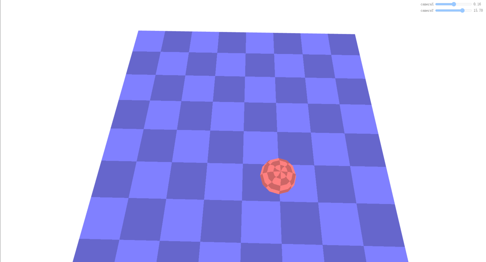

**投影映射** 是投影一张图像的过程，就像一个电影放映机对准一个屏幕，然后将电影投影到屏幕上。

## 1.平面的投影映射

平面的投影映射采用的时正交投影矩阵。我们将创建一个场景，绘制一个平面和一个球体，并使用`8x8` 棋盘纹理对它们进行贴图。下面是实现平面的投影映射的步骤和代码实现。
#### 1.顶点着色器代码
```js
// 顶点着色器
attribute vec4 a_position;
attribute vec2 a_texcoord;
uniform mat4 u_projection;
uniform mat4 u_view;
uniform mat4 u_world;
 
varying vec2 v_texcoord;
 
void main() {
  gl_Position = u_projection * u_view * u_world * a_position;
 
  // 把纹理坐标传给片段着色器
  v_texcoord = a_texcoord;
}
```
#### 2.片元着色器代码
添加了一个 `u_colorMult uniform` 来乘以纹理颜色。这样我们就可以通过制作一个单色纹理（`monochrome texture`）来改变它的颜色。
```js
// 片段着色器
precision mediump float;
// 从顶点着色器传来的
varying vec2 v_texcoord;
uniform vec4 u_colorMult;
uniform sampler2D u_texture;
 
void main() {
  gl_FragColor = texture2D(u_texture, v_texcoord) * u_colorMult;
}
```
#### 3.设置程序、球体 `buffers` 和平面 `buffers`
```js
// 设置 GLSL 程序
// 编译着色器、链接程序、查找 locations
const textureProgramInfo = webglUtils.createProgramInfo(gl, ['vertex-shader-3d', 'fragment-shader-3d']);
 
const sphereBufferInfo = primitives.createSphereBufferInfo(
    gl,
    1,  // 半径
    12, // 横轴细分数
    6,  // 纵轴细分数
);
const planeBufferInfo = primitives.createPlaneBufferInfo(
    gl,
    20,  // 宽
    20,  // 高
    1,   // 横轴细分数
    1,   // 纵轴细分数
)
```
#### 4.创建纹理
创建一个 `8x8` 棋盘纹理
```js
const checkerboardTexture = gl.createTexture();
gl.bindTexture(gl.TEXTURE_2D, checkerboardTexture);
gl.texImage2D(
    gl.TEXTURE_2D,
    0,                // mip level
    gl.LUMINANCE,     // internal format
    8,                // width
    8,                // height
    0,                // border
    gl.LUMINANCE,     // format
    gl.UNSIGNED_BYTE, // type
    new Uint8Array([  // data
      0xFF, 0xCC, 0xFF, 0xCC, 0xFF, 0xCC, 0xFF, 0xCC,
      0xCC, 0xFF, 0xCC, 0xFF, 0xCC, 0xFF, 0xCC, 0xFF,
      0xFF, 0xCC, 0xFF, 0xCC, 0xFF, 0xCC, 0xFF, 0xCC,
      0xCC, 0xFF, 0xCC, 0xFF, 0xCC, 0xFF, 0xCC, 0xFF,
      0xFF, 0xCC, 0xFF, 0xCC, 0xFF, 0xCC, 0xFF, 0xCC,
      0xCC, 0xFF, 0xCC, 0xFF, 0xCC, 0xFF, 0xCC, 0xFF,
      0xFF, 0xCC, 0xFF, 0xCC, 0xFF, 0xCC, 0xFF, 0xCC,
      0xCC, 0xFF, 0xCC, 0xFF, 0xCC, 0xFF, 0xCC, 0xFF,
    ]));
gl.generateMipmap(gl.TEXTURE_2D);
gl.texParameteri(gl.TEXTURE_2D, gl.TEXTURE_MAG_FILTER, gl.NEAREST);
```
#### 5.创建绘制函数

函数需要一个投影矩阵和一个相机矩阵作为参数，以便从相机矩阵中计算出视图矩阵，然后绘制球体和立方体
```js
// 每个物体的 uniforms
const planeUniforms = {
  u_colorMult: [0.5, 0.5, 1, 1],  // 浅蓝色
  u_texture: checkerboardTexture,
  u_world: m4.translation(0, 0, 0),
};
const sphereUniforms = {
  u_colorMult: [1, 0.5, 0.5, 1],  // 粉红色
  u_texture: checkerboardTexture,
  u_world: m4.translation(2, 3, 4),
};
 
function drawScene(projectionMatrix, cameraMatrix) {
  // 从相机矩阵中计算出视图矩阵
  const viewMatrix = m4.inverse(cameraMatrix);
 
  gl.useProgram(textureProgramInfo.program);
 
  // 设置球体和平面共享的 uniforms
  webglUtils.setUniforms(textureProgramInfo, {
    u_view: viewMatrix,
    u_projection: projectionMatrix,
  });

  // ------ 绘制球体 --------
 
  // 设置所有需要的 attributes
  webglUtils.setBuffersAndAttributes(gl, textureProgramInfo, sphereBufferInfo);
 
  // 设置球体特有的 uniforms
  webglUtils.setUniforms(textureProgramInfo, sphereUniforms);
 
  // 调用 gl.drawArrays 或 gl.drawElements
  webglUtils.drawBufferInfo(gl, sphereBufferInfo);
  // ------ 绘制平面 --------
 
  // 设置所有需要的 attributes
  webglUtils.setBuffersAndAttributes(gl, textureProgramInfo, planeBufferInfo);
 
  // 设置平面特有的 uniforms
  webglUtils.setUniforms(textureProgramInfo, planeUniforms);
 
  // 调用 gl.drawArrays 或 gl.drawElements
  webglUtils.drawBufferInfo(gl, planeBufferInfo);
}
```
#### 6.渲染场景
```js
const settings = {
  cameraX: 2.75,
  cameraY: 5,
};
const fieldOfViewRadians = degToRad(60);
 
function render() {
  webglUtils.resizeCanvasToDisplaySize(gl.canvas);
 
  // 告诉 WebGL 如何从裁剪空间转换为像素
  gl.viewport(0, 0, gl.canvas.width, gl.canvas.height);
 
  gl.enable(gl.CULL_FACE);
  gl.enable(gl.DEPTH_TEST);
 
  // 清除 canvas 和深度缓冲区
  gl.clear(gl.COLOR_BUFFER_BIT | gl.DEPTH_BUFFER_BIT);
 
  // 计算投影矩阵
  const aspect = gl.canvas.clientWidth / gl.canvas.clientHeight;
  const projectionMatrix =
      m4.perspective(fieldOfViewRadians, aspect, 1, 2000);
 
  // 使用 look at 计算相机的矩阵
  const cameraPosition = [settings.cameraX, settings.cameraY, 7];
  const target = [0, 0, 0];
  const up = [0, 1, 0];
  const cameraMatrix = m4.lookAt(cameraPosition, target, up);
 
  drawScene(projectionMatrix, cameraMatrix);
}
render();
```
视觉效果如下所示

<br>

`demo`地址[数据纹理](https://github.com/tangjie-93/WebGL/blob/main/fundmantalExamples/%E9%98%B4%E5%BD%B1/WebGL%E6%95%B0%E6%8D%AE%E7%BA%B9%E7%90%86.html)

**接下来我们将使用平面投影的方式将一个纹理投影到该球体和平面上**。
## 2.实现投影映射
#### 1.加载纹理
准备一张用于投影的纹理图片。
```js
function loadImageTexture(url) {
  // 创建一个纹理
  const texture = gl.createTexture();
  gl.bindTexture(gl.TEXTURE_2D, texture);
  // 用一个 1x1 蓝色像素填充该纹理
  gl.texImage2D(gl.TEXTURE_2D, 0, gl.RGBA, 1, 1, 0, gl.RGBA, gl.UNSIGNED_BYTE,
                new Uint8Array([0, 0, 255, 255]));
  // 异步加载一张图片
  const image = new Image();
  image.src = url;
  image.addEventListener('load', function() {
    // 现在图片加载完了，把它拷贝到纹理中
    gl.bindTexture(gl.TEXTURE_2D, texture);
    gl.texImage2D(gl.TEXTURE_2D, 0, gl.RGBA, gl.RGBA,gl.UNSIGNED_BYTE, image);
    // 假设该纹理的宽高是 2 的整次幂
    gl.generateMipmap(gl.TEXTURE_2D);
    render();
  });
  return texture;
}
const imageTexture = loadImageTexture('../../images/webgl/f-texture.png');
```
#### 2.修改片段着色器代码
在 `0.0` 到 `1.0` 之间的纹理坐标上绘制投影的纹理。而在这个范围外的纹理坐标，我们将会使用棋盘纹理。
```js
precision mediump float;
 
// 从顶点着色器传来的
varying vec2 v_texcoord;
varying vec4 v_projectedTexcoord;//投影纹理坐标
 
uniform vec4 u_colorMult;
uniform sampler2D u_texture;
uniform sampler2D u_projectedTexture;//投影纹理
 
void main() {
  //gl_FragColor = texture2D(u_texture, v_texcoord) * u_colorMult;
  // 除以 w 得到正确的值，详见透视投影的文章
  vec3 projectedTexcoord = v_projectedTexcoord.xyz / v_projectedTexcoord.w;
 
  bool inRange = 
      projectedTexcoord.x >= 0.0 &&
      projectedTexcoord.x <= 1.0 &&
      projectedTexcoord.y >= 0.0 &&
      projectedTexcoord.y <= 1.0;
 
  vec4 projectedTexColor = texture2D(u_projectedTexture, projectedTexcoord.xy);//投影纹理的颜色
  vec4 texColor = texture2D(u_texture, v_texcoord) * u_colorMult;//棋盘纹理的颜色
  gl_FragColor = inRange ? projectedTexColor：texColor;
}
```
#### 3.修改顶点着色器代码

为了计算投影的纹理坐标，我们会创建一个矩阵(`本质上是定义一个坐标系`)，该矩阵表示 `3D` 空间中一个确切方向的方位和位置。然后通过那个 `3D` 空间 投影球体顶点和平面顶点的世界坐标。

```js
attribute vec4 a_position;
attribute vec2 a_texcoord;
 
uniform mat4 u_projection;
uniform mat4 u_view;
uniform mat4 u_world;
// 为了计算投影的纹理坐标，而创建的矩阵
uniform mat4 u_textureMatrix;
 
varying vec2 v_texcoord;//数据纹理坐标
varying vec4 v_projectedTexcoord;//投影纹理坐标
 
void main() {
  vec4 worldPosition = u_world * a_position;
 
  //gl_Position = u_projection * u_view * u_world * a_position;
  gl_Position = u_projection * u_view * worldPosition;
 
  // 将纹理坐标传给片段着色器
  v_texcoord = a_texcoord;
 // 该矩阵可以让我们将其他物体的世界坐标转换为相对于该空间的坐标。
  v_projectedTexcoord = u_textureMatrix * worldPosition;
}
```
#### 4.修改绘制函数
像定义相机坐标系那样定义一个矩阵，然后对该矩阵**求逆**，该矩阵会将其他世界坐标转换为相对于这个空间的坐标。
```js
const settings = {
  cameraX: 2.75,
  cameraY: 5,
  posX: 3.5,
  posY: 4.4,
  posZ: 4.7,
  targetX: 0.8,
  targetY: 0,
  targetZ: 4.7,
};
 
function drawScene(projectionMatrix, cameraMatrix) {
  // 从相机矩阵中创建一个视图矩阵
  const viewMatrix = m4.inverse(cameraMatrix);
 
  let textureWorldMatrix = m4.lookAt(
      [settings.posX, settings.posY, settings.posZ],          // position
      [settings.targetX, settings.targetY, settings.targetZ], // target
      [0, 1, 0],                                              // up
  );
 
  // 使用这个世界矩阵的逆矩阵来创建一个矩阵，该矩阵会变换其他世界坐标 为相对于这个空间的坐标。
  const textureMatrix = m4.inverse(textureWorldMatrix);
 
  // 设置对球体和平面都一样的 uniforms
  webglUtils.setUniforms(textureProgramInfo, {
    u_view: viewMatrix,
    u_projection: projectionMatrix,
    u_textureMatrix: textureMatrix,
    u_projectedTexture: imageTexture,
  });

  ...
}
```
最总得到的投影纹理的视觉效果如下所示：<br>

<br>

`demo`地址[平面投影纹理](https://github.com/tangjie-93/WebGL/blob/main/fundmantalExamples/%E9%98%B4%E5%BD%B1/WebGL%E5%B9%B3%E9%9D%A2%E6%8A%95%E5%BD%B1%E6%98%A0%E5%B0%84.html)

## 3.绘制纹理所处的空间
通过绘制一个线框立方体来实现绘制纹理所处空间的视觉效果。以下是实现该效果的核心代码
#### 1.着色器代码
准备一个单独的着色器集合。这些着色器只能绘制纯色，没有纹理。
```js
<script id="color-vertex-shader" type="x-shader/x-vertex">
attribute vec4 a_position;
 
uniform mat4 u_projection;
uniform mat4 u_view;
uniform mat4 u_world;
 
void main() {
  // 将 position 乘以矩阵
  gl_Position = u_projection * u_view * u_world * a_position;
}
</script>
```
```js
<script id="color-fragment-shader" type="x-shader/x-fragment">
precision mediump float;
 
uniform vec4 u_color;
void main() {
  gl_FragColor = u_color;
}
</script>
```
#### 2.编译和链接着色器
```js
const colorProgramInfo = webglUtils.createProgramInfo(gl, ['color-vertex-shader', 'color-fragment-shader']);
```
#### 3.准备绘制立方体的数据
```js
const cubeLinesBufferInfo = webglUtils.createBufferInfoFromArrays(gl, {
  position: [
    -1, -1, -1,
     1, -1, -1,
    -1,  1, -1,
     1,  1, -1,
    -1, -1,  1,
     1, -1,  1,
    -1,  1,  1,
     1,  1,  1,
  ],
  indices: [
    0, 1,
    1, 3,
    3, 2,
    2, 0,
 
    4, 5,
    5, 7,
    7, 6,
    6, 4,
 
    0, 4,
    1, 5,
    3, 7,
    2, 6,
  ],
});
```
#### 4.绘制立方体
我们要将立方体绘制绘制在纹理投影空间内，就需要将坐标转换到该空间，所以需要使用`textureWorldMatrix`作为模型矩阵。
```js
function drawScene(projectionMatrix, cameraMatrix) {
 
  ...
  // ------ 绘制立方体 ------
 
  gl.useProgram(colorProgramInfo.program);
 
  // 设置所有需要的 attributes
  webglUtils.setBuffersAndAttributes(gl, colorProgramInfo, cubeLinesBufferInfo);
 
  // 在 Z 轴上缩放该立方体，
  // 以便表示该纹理是被投影到无限远的。
  const mat = m4.scale(textureWorldMatrix, 1, 1, 1000);
 
  // 设置我们计算出来的 unifroms
  webglUtils.setUniforms(colorProgramInfo, {
    u_color: [0, 0, 0, 1],
    u_view: viewMatrix,
    u_projection: projectionMatrix,
    u_world: mat,
  });
 
  // 调用 gl.drawArrays 或者 gl.drawElements
  webglUtils.drawBufferInfo(gl, cubeLinesBufferInfo, gl.LINES);
}
```

视觉效果如下所示：


`demo`地址[平面投影映射-视锥体](https://github.com/tangjie-93/WebGL/blob/main/fundmantalExamples/%E9%98%B4%E5%BD%B1/WebGL%E5%B9%B3%E9%9D%A2%E6%8A%95%E5%BD%B1%E6%98%A0%E5%B0%84-%E8%A7%86%E9%94%A5%E4%BD%93.html)

有一点需要注意的是，我们并没有真正地投影该纹理。为了做到这一点，我们需要使用一个`投影矩阵`。

## 4.绘制纹理的投影空间

#### 1.计算投影矩阵
```js
const textureProjectionMatrix = settings.perspective
    ? m4.perspective(
        degToRad(settings.fieldOfView),
        settings.projWidth / settings.projHeight,
        0.1,  // near
        200)  // far
    : m4.orthographic(
        -settings.projWidth / 2,   // left
        settings.projWidth / 2,   // right
        -settings.projHeight / 2,  // bottom
        settings.projHeight / 2,  // top
        0.1,                      // near
        200); 
// 计算纹理的投影矩阵
const textureMatrix = m4.multiply(
    textureProjectionMatrix,
    m4.inverse(textureWorldMatrix)); 
```
在绘制线框的时候我们也需要使用那个投影矩阵
```js
// 调整立方体使其匹配该投影
const mat = m4.multiply(
    textureWorldMatrix, m4.inverse(textureProjectionMatrix));
```

但我们的投影和我们的线框立方体都只是使用了 `0` 到 `1` 的空间， 所以它只使用到了投影视椎体的 `1/4`。

要修复这个问题，首先让我们的立方体在所有方向上都是 `-1` 到 `+1`。
```js
const cubeLinesBufferInfo = webglUtils.createBufferInfoFromArrays(gl, {
  position: [
    -1, -1, -1,
     1, -1, -1,
    -1,  1, -1,
     1,  1, -1,
    -1, -1,  1,
     1, -1,  1,
    -1,  1,  1,
     1,  1,  1,
  ],
  indices: [
    0, 1,
    1, 3,
    3, 2,
    2, 0,
 
    4, 5,
    5, 7,
    7, 6,
    6, 4,
 
    0, 4,
    1, 5,
    3, 7,
    2, 6,
  ],
});
```
然后当将其用于纹理矩阵时，我们需要使视椎体内的空间范围是 `0` 到 `1`。 这可以通过使空间偏移 `0.5` 然后将其缩放 `0.5` 倍来实现。
**解释**：`[-1,1]` 缩放`0.5`后变成 `[-0.5,0.5]`，然后偏移 `0.5` 变成 `[0,1]`。 
```js
const textureWorldMatrix = m4.lookAt(
    [settings.posX, settings.posY, settings.posZ],          // position
    [settings.targetX, settings.targetY, settings.targetZ], // target
    [0, 1, 0],                                              // up
);
const textureProjectionMatrix = settings.perspective
    ? m4.perspective(
        degToRad(settings.fieldOfView),
        settings.projWidth / settings.projHeight,
        0.1,  // near
        200)  // far
    : m4.orthographic(
        -settings.projWidth / 2,   // left
         settings.projWidth / 2,   // right
        -settings.projHeight / 2,  // bottom
         settings.projHeight / 2,  // top
         0.1,                      // near
         200);                     // far 
let textureMatrix = m4.identity();
//矩阵的运算是从右向左进行，所以先平移再缩放
textureMatrix = m4.translate(textureMatrix, 0.5, 0.5, 0.5);
textureMatrix = m4.scale(textureMatrix, 0.5, 0.5, 0.5);
textureMatrix = m4.multiply(textureMatrix, textureProjectionMatrix);
// 使用这个世界矩阵的逆矩阵来创建
// 一个矩阵，该矩阵会变换其他世界坐标
// 为相对于这个空间的坐标。
textureMatrix = m4.multiply(
    textureMatrix,
    m4.inverse(textureWorldMatrix));
```

`demo`地址[平面投影映射-视锥体-使用投影矩阵](https://github.com/tangjie-93/WebGL/blob/main/fundmantalExamples/%E9%98%B4%E5%BD%B1/WebGL%E5%B9%B3%E9%9D%A2%E6%8A%95%E5%BD%B1%E6%98%A0%E5%B0%84-%E8%A7%86%E9%94%A5%E4%BD%93-%E4%BD%BF%E7%94%A8%E6%8A%95%E5%BD%B1%E7%9F%A9%E9%98%B5.html)

**参考文档**

[WebGL 阴影](https://webglfundamentals.org/webgl/lessons/zh_cn/webgl-shadows.html)<br>

<Valine></Valine>