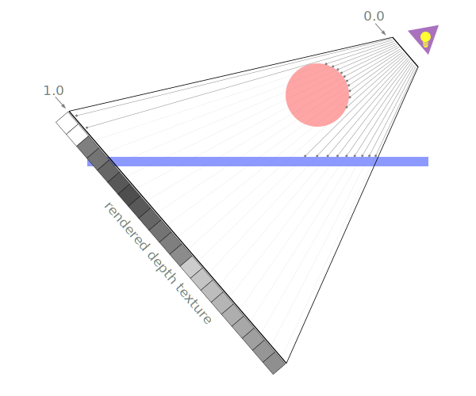
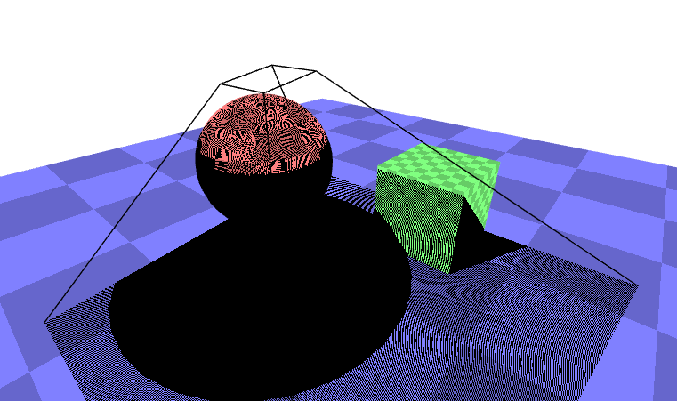
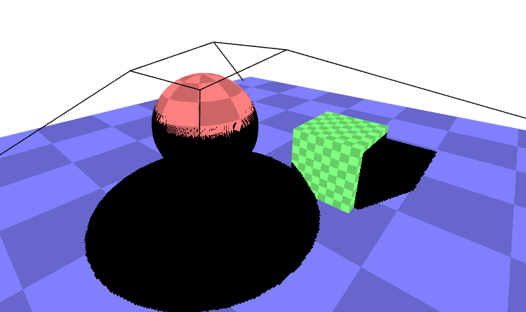

在 [平面的投影映射文章](https://github.com/tangjie-93/WebGL/blob/main/fundmantalExamples/%E6%8A%95%E5%BD%B1%E6%98%A0%E5%B0%84/WebGL%E5%B9%B3%E9%9D%A2%E6%8A%95%E5%BD%B1%E6%98%A0%E5%B0%84-%E8%A7%86%E9%94%A5%E4%BD%93-%E4%BD%BF%E7%94%A8%E6%8A%95%E5%BD%B1%E7%9F%A9%E9%98%B5.html) 中，我们知道了如何将一张图像投影到物体上，假如视锥体的顶端有一个光源，而被投影的纹理包含了在该光源视角下的深度信息，那么球体会得到一个更加接近光源的深度值，而平面会得到一个稍微远离光源的深度值。越靠近光源的像素的深度值越小。

<br>

如果我们具有了这些深度信息，那么我们在选择要渲染哪个颜色的时候，我们就可以从被投影的纹理中进行采样，得到一个采样深度值，然后和当前正在绘制的像素的深度值进行比较。如果当前像素的深度值比采样得到的深度值大，则说明还有其他东西比当前像素更加接近光源。也就是说，某样东西挡住了光源，因此该像素是处于阴影中的。

下面让我们来实现绘制阴影映射，下面是实现该效果的核心代码。
#### 1. 开启`WEBGL_depth_texture`扩展
```js
function main() {
  // 获得一个 WebGL context
  /** @type {HTMLCanvasElement} */
  const canvas = document.querySelector('#canvas');
  const gl = canvas.getContext('webgl');
  if (!gl) {
    return;
  }
 
  const ext = gl.getExtension('WEBGL_depth_texture');
  if (!ext) {
    return;
  }
}
```
#### 2.渲染到纹理
+ 创建纹理
```js
const depthTexture = gl.createTexture();
const depthTextureSize = 512;
gl.bindTexture(gl.TEXTURE_2D, depthTexture);
gl.texImage2D(
    gl.TEXTURE_2D,      // target
    0,                  // mip level
    gl.DEPTH_COMPONENT, // internal format
    depthTextureSize,   // width
    depthTextureSize,   // height
    0,                  // border
    gl.DEPTH_COMPONENT, // format
    gl.UNSIGNED_INT,    // type
    null);              // data
gl.texParameteri(gl.TEXTURE_2D, gl.TEXTURE_MAG_FILTER, gl.NEAREST);
gl.texParameteri(gl.TEXTURE_2D, gl.TEXTURE_MIN_FILTER, gl.NEAREST);
gl.texParameteri(gl.TEXTURE_2D, gl.TEXTURE_WRAP_S, gl.CLAMP_TO_EDGE);
gl.texParameteri(gl.TEXTURE_2D, gl.TEXTURE_WRAP_T, gl.CLAMP_TO_EDGE);
```
+ 创建帧缓冲
随后将刚刚创建的纹理作为`DEPTH_ATTACHMENT`附加到帧缓冲上。
```js
const depthFramebuffer = gl.createFramebuffer();
gl.bindFramebuffer(gl.FRAMEBUFFER, depthFramebuffer);
gl.framebufferTexture2D(
    gl.FRAMEBUFFER,       // target
    gl.DEPTH_ATTACHMENT,  // attachment point
    gl.TEXTURE_2D,        // texture target
    depthTexture,         // texture
    0);  
```
+ 创建颜色纹理
并把它作为一个 `color attachment` 附加到帧缓冲上，即使我们并不会使用它。
```js
// 创建一个和深度纹理相同尺寸的颜色纹理
const unusedTexture = gl.createTexture();
gl.bindTexture(gl.TEXTURE_2D, unusedTexture);
gl.texImage2D(
    gl.TEXTURE_2D,
    0,
    gl.RGBA,
    depthTextureSize,
    depthTextureSize,
    0,
    gl.RGBA,
    gl.UNSIGNED_BYTE,
    null,
);
gl.texParameteri(gl.TEXTURE_2D, gl.TEXTURE_MAG_FILTER, gl.NEAREST);
gl.texParameteri(gl.TEXTURE_2D, gl.TEXTURE_MIN_FILTER, gl.NEAREST);
gl.texParameteri(gl.TEXTURE_2D, gl.TEXTURE_WRAP_S, gl.CLAMP_TO_EDGE);
gl.texParameteri(gl.TEXTURE_2D, gl.TEXTURE_WRAP_T, gl.CLAMP_TO_EDGE);
 
// 把它附加到该帧缓冲上
gl.framebufferTexture2D(
    gl.FRAMEBUFFER,        // target
    gl.COLOR_ATTACHMENT0,  // attachment point
    gl.TEXTURE_2D,         // texture target
    unusedTexture,         // texture
    0);     
```
为了使用深度纹理，我们还需要能够使用不同的着色器来渲染场景多次。一次是一个简单的着色器，只是为了渲染到深度纹理上，然后再使用我们当前的着色器，该着色器会投影一个纹理。

#### 3.绘制场景函数
```js
function drawScene(projectionMatrix, cameraMatrix, textureMatrix, programInfo) {
  // 从相机矩阵中创建一个视图矩阵
  const viewMatrix = m4.inverse(cameraMatrix);
 
  gl.useProgram(programInfo.program);
 
  // 设置对于球体和平面都是一样的 uniforms
  // 注意：在着色器中，任何没有对应 uniform 的值都会被忽略。
  webglUtils.setUniforms(programInfo, {
    u_view: viewMatrix,
    u_projection: projectionMatrix,
    u_textureMatrix: textureMatrix,
    u_projectedTexture: imageTexture,
    u_projectedTexture: depthTexture,
  });
 
  // ------ 绘制球体 --------
  // 设置所有需要的 attributes
  webglUtils.setBuffersAndAttributes(gl, programInfo, sphereBufferInfo);
  // 设置球体特有的 uniforms
  webglUtils.setUniforms(programInfo, sphereUniforms);
  // 调用 gl.drawArrays 或 gl.drawElements
  webglUtils.drawBufferInfo(gl, sphereBufferInfo);
 
  // ------ 绘制平面 --------
  // 设置所有需要的 attributes
  webglUtils.setBuffersAndAttributes(gl, programInfo, planeBufferInfo);
  // 设置我们刚刚计算的 uniforms
  webglUtils.setUniforms(programInfo, planeUniforms);
  // 调用 gl.drawArrays 或 gl.drawElements
  webglUtils.drawBufferInfo(gl, planeBufferInfo);
}
```
#### 4.渲染函数
使用该函数从光源视角绘制一次场景，然后使用深度纹理再绘制一次场景
```js
function render() {
  webglUtils.resizeCanvasToDisplaySize(gl.canvas);
 
  gl.enable(gl.CULL_FACE);
  gl.enable(gl.DEPTH_TEST);
 
  // 首先从光源的视角绘制一次
  const lightWorldMatrix = m4.lookAt(
      [settings.posX, settings.posY, settings.posZ],          // position
      [settings.targetX, settings.targetY, settings.targetZ], // target
      [0, 1, 0],                                              // up
  );
  const lightProjectionMatrix = settings.perspective
      ? m4.perspective(
          degToRad(settings.fieldOfView),
          settings.projWidth / settings.projHeight,
          0.5,  // near
          10)   // far
      : m4.orthographic(
          -settings.projWidth / 2,   // left
           settings.projWidth / 2,   // right
          -settings.projHeight / 2,  // bottom
           settings.projHeight / 2,  // top
           0.5,                      // near
           10);                      // far
 
  // 绘制到深度纹理
  gl.bindFramebuffer(gl.FRAMEBUFFER, depthFramebuffer);
  gl.viewport(0, 0, depthTextureSize, depthTextureSize);
  gl.clear(gl.COLOR_BUFFER_BIT | gl.DEPTH_BUFFER_BIT);
  drawScene(lightProjectionMatrix, lightWorldMatrix, m4.identity(), colorProgramInfo);
 
  // 现在绘制场景到画布，把深度纹理投影到场景内
  gl.bindFramebuffer(gl.FRAMEBUFFER, null);
  gl.viewport(0, 0, gl.canvas.width, gl.canvas.height);
  gl.clear(gl.COLOR_BUFFER_BIT | gl.DEPTH_BUFFER_BIT);
 
  let textureMatrix = m4.identity();
  textureMatrix = m4.translate(textureMatrix, 0.5, 0.5, 0.5);
  textureMatrix = m4.scale(textureMatrix, 0.5, 0.5, 0.5);
  textureMatrix = m4.multiply(textureMatrix, lightProjectionMatrix);
  // 使用该世界矩阵的逆矩阵来创建一个
  // 可以变换其他坐标为相对于这个世界空间
  // 的矩阵。
  textureMatrix = m4.multiply(
      textureMatrix,
      m4.inverse(lightWorldMatrix));
 
  // 计算投影矩阵
  const aspect = gl.canvas.clientWidth / gl.canvas.clientHeight;
  const projectionMatrix =
      m4.perspective(fieldOfViewRadians, aspect, 1, 2000);
 
  // 使用 look at 计算相机的矩阵
  const cameraPosition = [settings.cameraX, settings.cameraY, 7];
  const target = [0, 0, 0];
  const up = [0, 1, 0];
  const cameraMatrix = m4.lookAt(cameraPosition, target, up);
  drawScene(projectionMatrix, cameraMatrix, textureMatrix, textureProgramInfo); 
}
```
在上面的代码中，我们首先使用之前绘制视椎体线框的着色器来渲染球体和平面到深度纹理中。那个着色器只会绘制了纯色的东西，并没有做什么特别的事情，这就是当渲染到深度纹理时我们所需要做的全部事情。

然后，我们再渲染场景到画布中，就像我们之前做的那样，把纹理投影到场景内。当我们在着色器内引用深度纹理时，只有红色分量是有效的，所以我们会重复红色分量作为绿色分量和蓝色分量。
```js
void main() {
  vec3 projectedTexcoord = v_projectedTexcoord.xyz / v_projectedTexcoord.w;
  bool inRange = 
      projectedTexcoord.x >= 0.0 &&
      projectedTexcoord.x <= 1.0 &&
      projectedTexcoord.y >= 0.0 &&
      projectedTexcoord.y <= 1.0;
 
  vec4 projectedTexColor = texture2D(u_projectedTexture, projectedTexcoord.xy);
  // 'r' 通道内包含深度值
  vec4 projectedTexColor = vec4(texture2D(u_projectedTexture, projectedTexcoord.xy).rrr, 1);
  vec4 texColor = texture2D(u_texture, v_texcoord) * u_colorMult;
  float projectedAmount = inRange ? 1.0 : 0.0;
  gl_FragColor = mix(texColor, projectedTexColor, projectedAmount);
}
```
趁此机会，让我们添加一个立方体到场景中
```js
const cubeBufferInfo = primitives.createCubeBufferInfo(
    gl,
    2,  // size
);
 
...
 
const cubeUniforms = {
  u_colorMult: [0.5, 1, 0.5, 1],  // 绿色的光源
  u_color: [0, 0, 1, 1],
  u_texture: checkerboardTexture,
  u_world: m4.translation(3, 1, 0),
};
 
...
 
function drawScene(projectionMatrix, cameraMatrix, textureMatrix, programInfo) {
 
    ...
 
    // ------ 绘制立方体 --------
 
    // 设置所需要的所有 attributes
    webglUtils.setBuffersAndAttributes(gl, programInfo, cubeBufferInfo);
 
    // 设置我们刚刚计算的 uniforms
    webglUtils.setUniforms(programInfo, cubeUniforms);
 
    // 调用 gl.drawArrays 或 gl.drawElements
    webglUtils.drawBufferInfo(gl, cubeBufferInfo);
 
...
}
```
深度值的范围是 `0.0` 到 `1.0`，代表它们在视椎体内的位置，因此 `0.0`（暗）表示接近视椎体的顶端的那端，而 `1.0`（亮）则是位于较远的开口那端。

因此，剩下要做的就是，我们不在投影纹理的颜色和映射纹理的颜色中做选择，我们可以使用深度纹理中的深度值来检查深度纹理的 Z 位置是离光源更近还是更远，然后再检查要绘制的像素的深度值。如果深度纹理的深度值更小，则表明有某物挡住了光源，该像素位于阴影中。
```js
void main() {
  vec3 projectedTexcoord = v_projectedTexcoord.xyz / v_projectedTexcoord.w;
  float currentDepth = projectedTexcoord.z;
 
  bool inRange = 
      projectedTexcoord.x >= 0.0 &&
      projectedTexcoord.x <= 1.0 &&
      projectedTexcoord.y >= 0.0 &&
      projectedTexcoord.y <= 1.0;
 
  float projectedDepth = texture2D(u_projectedTexture, projectedTexcoord.xy).r;
  float shadowLight = (inRange && projectedDepth <= currentDepth) ? 0.0 : 1.0;  
 
  vec4 texColor = texture2D(u_texture, v_texcoord) * u_colorMult;
  gl_FragColor = vec4(texColor.rgb * shadowLight, texColor.a);
}
```
在上面的代码中，如果 `projectedDepth` 小于 `currentDepth` ，则从光源视角来看，有某物更加接近光源，所以正在绘制的像素位于阴影中。

此时的视觉效果如下所示



我们可以在地面看到球体的阴影，但是这些位于应该没有阴影的地方的奇怪图案是什么？这些图案被称为阴影痤疮（`shadow acne`）。这些图案的来源是因为存储在深度纹理里的深度数据已经被量化了，深度数据已经是一个纹理，一个像素网格了，它被从光源视角中投影出来，但是我们要把它和相机视角的深度值进行比较。即意味着在这个深度纹理网格中的值和我们相机没有对齐，因此，当我们计算 `currentDepth` 时，有时会出现比 `projectedDepth` 稍微大的值，有时会出现稍微小的值。

让我们添加一个偏差值（bias）。
```js
...
 
uniform float u_bias;
 
void main() {
  vec3 projectedTexcoord = v_projectedTexcoord.xyz / v_projectedTexcoord.w;
  float currentDepth = projectedTexcoord.z;
  float currentDepth = projectedTexcoord.z + u_bias;
 
  bool inRange = 
      projectedTexcoord.x >= 0.0 &&
      projectedTexcoord.x <= 1.0 &&
      projectedTexcoord.y >= 0.0 &&
      projectedTexcoord.y <= 1.0;
 
  float projectedDepth = texture2D(u_projectedTexture, projectedTexcoord.xy).r;
  float shadowLight = (inRange && projectedDepth <= currentDepth) ? 0.0 : 1.0;  
 
  vec4 texColor = texture2D(u_texture, v_texcoord) * u_colorMult;
  gl_FragColor = vec4(texColor.rgb * shadowLight, texColor.a);
}
```
此时的视觉效果如下



`demo`地址 [无光照阴影](https://github.com/tangjie-93/WebGL/blob/main/fundmantalExamples/%E9%98%B4%E5%BD%B1/%E6%97%A0%E5%85%89%E7%85%A7%E9%98%B4%E5%BD%B1.html)

为了使阴影效果更接近于完整，让我们真地添加一个聚光灯，聚光灯的计算方法从 [聚光灯文章](https://github.com/tangjie-93/WebGL/blob/main/fundmantalExamples/%E5%85%89%E7%85%A7/%E4%B8%89%E7%BB%B4%E8%81%9A%E5%85%89%E7%81%AF.html) 中来。

使用聚光灯之后的`demo`地址 [聚光灯阴影](https://github.com/tangjie-93/WebGL/blob/main/fundmantalExamples/%E9%98%B4%E5%BD%B1/%E8%81%9A%E5%85%89%E7%81%AF%E9%98%B4%E5%BD%B1.html)

除了使用聚光灯，我们也可以使用平行光来实现阴影效果，具体的`demo`地址 [方向光源-阴影](https://github.com/tangjie-93/WebGL/blob/main/fundmantalExamples/%E9%98%B4%E5%BD%B1/%E6%96%B9%E5%90%91%E5%85%89%E6%BA%90-%E9%98%B4%E5%BD%B1.html)


`demo`地址：[方向光源-阴影](https://github.com/tangjie-93/WebGL/blob/main/fundmantalExamples/%E9%98%B4%E5%BD%B1/%E6%96%B9%E5%90%91%E5%85%89%E6%BA%90-%E9%98%B4%E5%BD%B1.html)

`demo`地址：[聚光灯-阴影](https://github.com/tangjie-93/WebGL/blob/main/fundmantalExamples/%E9%98%B4%E5%BD%B1/%E8%81%9A%E5%85%89%E7%81%AF%E9%98%B4%E5%BD%B1.html)

`demo`地址：[无光照-阴影](https://github.com/tangjie-93/WebGL/blob/main/fundmantalExamples/%E9%98%B4%E5%BD%B1/%E6%97%A0%E5%85%89%E7%85%A7%E9%98%B4%E5%BD%B1.html)


**参考文档**

[WebGL 阴影](https://webglfundamentals.org/webgl/lessons/zh_cn/webgl-shadows.html)<br>

<Valine></Valine>
