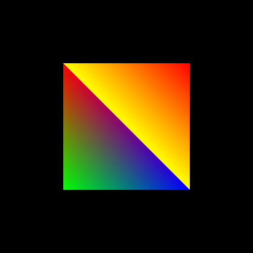
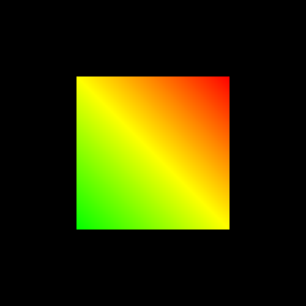

绘制矩形的方式多种多样。以下是我总结的5中绘制方式。矩形的绘制是在三角形的基础上进行绘制的。所以代码没有多大改动，唯一的区别在于构造数据时，需要的顶点个数不同。

+ 顶点着色器代码
```js
<script id="vertexShader" type="x-shader/x-vertex">
//attribute声明vec3类型变量apos
attribute vec3 apos;
void main() {
    //顶点坐标apos赋值给内置变量gl_Position
    //逐顶点处理数据
    gl_Position = vec4(apos,1.0);
}
</script>
```
+ 片元着色器代码
```js
<script id="fragmentShader" type="x-shader/x-fragment">
void main() {
    // 逐片元处理数据，所有片元(像素)设置为红色
    gl_FragColor = vec4(1.0,0.0,0.0,1.0);
}
</script>
```
+ javascript代码部分
    + `WebGL`上下文的获取
    ```js
    function init() {
		 const canvas = document.getElementById('WebGL');
        const gl = canvas.getContext('WebGL');
        //创建着色器程序
        const program = initShader(gl);
        const count= assignValue(gl,program);
        render(gl,count);
	}
    ```
    + 声明初始化着色器函数
    ```js
    function initShader(gl) {
         //顶点着色器源码
        const vertexShaderSource = document.getElementById('vertexShader').innerText;
        //片元着色器源码
        const fragmentShaderSource = document.getElementById('fragmentShader').innerText;
		const vertexShader = gl.createShader(gl.VERTEX_SHADER);
		const fragmentShader = gl.createShader(gl.FRAGMENT_SHADER);
		gl.shaderSource(vertexShader, vertexShaderSource);
		gl.shaderSource(fragmentShader, fragmentShaderSource);
		gl.compileShader(vertexShader);
		gl.compileShader(fragmentShader);
		var program = gl.createProgram();
		gl.attachShader(program, vertexShader);
		gl.attachShader(program, fragmentShader);
		gl.linkProgram(program);
		gl.useProgram(program);
		return program;
	}
    ```
    + 着色器代码变量赋值
    ```js
    // 定义组成矩形的4个三角形，共计6个顶点，左边三角形V0->V1->V2;下边三角形 V0->V4->V1;右边三角形 V0->V3->V4;上边三角形 V0->V4-V1 。
            const positions = new Float32Array([
                //V0
                -0.5, 0.5, 1.0, 1.0, 0.0, 1.0,
                //V1
                0.5, 0.5, 1.0, 0.0, 0.0, 1.0,
                //V2
                0.5, -0.5, 1.0, 1.0, 0.0, 1.0,
                //V3
                -0.5, 0.5, 1.0, 0.0, 0.0, 1.0,
                //V4
                0.5, -0.5, 0.0, 0.0, 1.0, 1.0,
                //V5
                -0.5, -0.5, 0.0, 1.0, 0.0, 1.0,
            ]);

            const a_Position = gl.getAttribLocation(program, 'a_Position');
            const a_Color = gl.getAttribLocation(program, 'a_Color');

            gl.enableVertexAttribArray(a_Position);
            gl.enableVertexAttribArray(a_Color);
            // 创建缓冲区
            let buffer = gl.createBuffer();
            // 绑定缓冲区为当前缓冲
            gl.bindBuffer(gl.ARRAY_BUFFER, buffer);
            // 设置 a_Position 属性从缓冲区读取数据方式
            gl.vertexAttribPointer(a_Position, 2, gl.FLOAT, false, 24, 0);
            // 设置 a_Color 属性从缓冲区读取数据方式
            gl.vertexAttribPointer(a_Color, 4, gl.FLOAT, false, 24, 8);
            // 向缓冲区传递数据
            gl.bufferData(gl.ARRAY_BUFFER, positions, gl.STATIC_DRAW);
            return positions.length / 6;
    ```
    + `WebGL`渲染函数
    ```js
    function render(program, gl) {
		//获取顶点着色器的位置变量apos，即aposLocation指向apos变量。
		const aposLocation = gl.getAttribLocation(program, "apos");
		//类型数组构造函数Float32Array创建顶点数组
		const data = new Float32Array([
			-0.5,0.5,0.0,
			0.5,0.5,0.0,
			0.5,-0.5,0.0,
			-0.5,0.5,0.0,
			0.5,-0.5,0.0,
			-0.5,-0.5,0.0,
		]);
		//创建缓冲区对象
		const buffer = gl.createBuffer();
		//绑定缓冲区对象,激活buffer
		gl.bindBuffer(gl.ARRAY_BUFFER, buffer);
		//顶点数组data数据传入缓冲区
		gl.bufferData(gl.ARRAY_BUFFER, data, gl.STATIC_DRAW);
		//允许数据传递
		gl.enableVertexAttribArray(aposLocation);
		//缓冲区中的数据按照一定的规律传递给位置变量apos
		gl.vertexAttribPointer(aposLocation, 3, gl.FLOAT, false, 0, 0);
		//设置画布的颜色
		gl.clearColor(0.0, 0.0, 0.0, 0.3);
		gl.clear(gl.COLOR_BUFFER_BIT);
		//开始绘制图形  data.length/3表示顶顶数据的个数
		gl.drawArrays(gl.TRIANGLES, 0, data.length/3);
	}
    ```

下面这几种绘制矩形的方式主要的不同在于**数据构造**及**绘制方式**上。
#### 1、常规方式
+ 数据构造
```js
// 定义组成矩形的4个三角形，共计6个顶点
let positions = new Float32Array([
    //V0
    -0.5, 0.5, 1.0, 1.0, 0.0, 1.0,
    //V1
    0.5, 0.5, 1.0, 0.0, 0.0, 1.0,
    //V2
    0.5, -0.5, 1.0, 1.0, 0.0, 1.0,
    //V3
    -0.5, 0.5, 1.0, 0.0, 0.0, 1.0,
    //V4
    0.5, -0.5, 0.0, 0.0, 1.0, 1.0,
    //V5
    -0.5, -0.5, 0.0, 1.0, 0.0, 1.0,
]);
```
+ 绘制方式
```js
//开始绘制图形  data.length/3表示顶顶数据的个数
gl.drawArrays(gl.TRIANGLES, 0, data.length/3);
```
效果图如下：


#### 2、三角形扇
这种绘制方式，绘制三角形时，绘制下一个三角形的前两个顶点，第一个顶点是确定的就三角形的第一个顶点，第二个顶点为上一个三角形的最后一个顶点。
+ 数据构造
```js
// 定义组成矩形的4个三角形，共计6个顶点
let positions = new Float32Array([
    //V0
    -0.5, 0.5, 1.0, 1.0, 0.0, 1.0,
    //V1
    0.5, 0.5, 1.0, 0.0, 0.0, 1.0,
    //V2
    0.5, -0.5, 1.0, 1.0, 0.0, 1.0,
    //V3
    -0.5, -0.5, 0.0, 1.0, 0.0, 1.0,
]);
```
+ 绘制方式
```js
//开始绘制图形  data.length/3表示顶顶数据的个数
gl.drawArrays(gl.TRIANGLE_FAN, 0, data.length/3);
```
效果图如下：


### 3、三角形带
这种绘制方式，绘制三角形时，绘制下一个三角形的前两个顶点为上一个三角形的后两个顶点。
+ 数据构造
```js
// 定义组成矩形的4个三角形，共计6个顶点
const positions = new Float32Array([
    //V0
    0.5, 0.5, 1.0, 0.0, 0.0, 1.0,
    //V1
    -0.5, 0.5, 1.0, 1.0, 0.0, 1.0,
    //V2
    0.5, -0.5, 1.0, 1.0, 0.0, 1.0,
    //V3
    -0.5, -0.5, 0.0, 1.0, 0.0, 1.0,
]);
```
+ 绘制方式
```js
//绘制方法 每一行6个数据
gl.drawArrays(gl.TRIANGLE_STRIP, 0, positions.length / 6);
```
效果图如下：


### 4、闭合线段
+ 数据构造
```js
// 定义组成矩形的4个顶点
const positions = new Float32Array([
    //V0
    0.5, 0.5, 1.0, 0.0, 0.0, 1.0,
    //V1
    -0.5, 0.5, 1.0, 1.0, 0.0, 1.0,
    //V2
    -0.5, -0.5, 0.0, 1.0, 0.0, 1.0,
    //V3
    0.5, -0.5, 1.0, 1.0, 0.0, 1.0,
]);
```
+ 绘制方式
```js
//绘制方法 每一行6个数据
gl.drawArrays(gl.LINE_LOOP, 0, positions.length/6);
```

### 5、顶点索引
顶点索引跟上面的区别在于缓冲区数据的构造及渲染方式不一样。
+ 缓冲区的创建
```js
//缓冲区的创建
function assignValue(gl, program) {
    // 定义组成矩形的4个三角形，共计6个顶点
    const positions = new Float32Array([
        //V0
        -0.5, 0.5, 1.0, 1.0, 0.0, 1.0,
        //V1
        0.5, 0.5, 1.0, 0.0, 0.0, 1.0,
        //V2
        0.5, -0.5, 1.0, 1.0, 0.0, 1.0,
        //v3
        -0.5, -0.5, 0.0, 1.0, 0.0, 1.0,
    ]);
    
    //创建顶点缓冲区对象
    let vertexBuffer = gl.createBuffer();
    gl.bindBuffer(gl.ARRAY_BUFFER, vertexBuffer);
    gl.bufferData(gl.ARRAY_BUFFER, positions, gl.STATIC_DRAW);

    const indexes = new Uint8Array([0, 1, 2, 0, 2, 3]);
    //创建索引缓冲区对象
    var indexesBuffer = gl.createBuffer();
    //绑定缓冲区对象
    gl.bindBuffer(gl.ELEMENT_ARRAY_BUFFER, indexesBuffer);
    //索引数组indexes数据传入缓冲区
    gl.bufferData(gl.ELEMENT_ARRAY_BUFFER, indexes, gl.STATIC_DRAW);
    let a_Position = gl.getAttribLocation(program, 'a_Position');
    let a_Color = gl.getAttribLocation(program, 'a_Color');
    gl.enableVertexAttribArray(a_Position);
    gl.enableVertexAttribArray(a_Color);

    // 设置 a_Position 属性从缓冲区读取数据方式
    gl.vertexAttribPointer(a_Position, 2, gl.FLOAT, false, 24, 0);
    // 设置 a_Color 属性从缓冲区读取数据方式
    gl.vertexAttribPointer(a_Color, 4, gl.FLOAT, false, 24, 8);
    return indexes.length;
}
```
+ 绘制方式
```js
//绘制方式 这个count表示 i索引数据的个数 count=indexes.length
gl.drawElements(gl.TRIANGLES, count, gl.UNSIGNED_BYTE, 0);
```
效果图如下：


**参考**

[WebGL零基础入门教程(郭隆邦)](http://www.yanhuangxueyuan.com/WebGL/)
[WebGL 入门与实践](https://juejin.cn/book/6844733755580481543/section/6844733755916025869)
[WebGL官方文档](https://developer.mozilla.org/zh-CN/docs/Web/API/WebGLRenderingContext/vertexAttribPointer)
