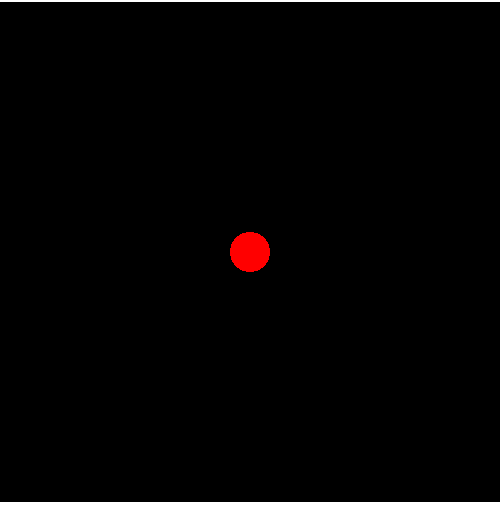
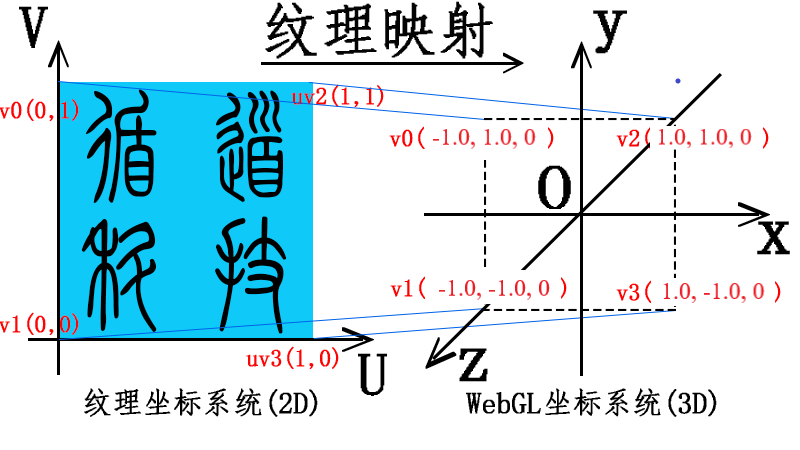

## 1、什么是GLSL？

`GLSL` 的中文意思是 `OpenGL` 着色语言，英文全称是 `OpenGL Shading Language`，它是用来在 `OpenGL` 编写 **着色器程序** 的语言。

#### 1、着色器程序

着色器程序是在显卡（GPU）上运行的简短程序，代替 **`GPU`固定渲染管线** 的一部分，使 GPU 渲染过程中的某些部分允许开发者通过编程进行控制。**着色器程序允许我们通过编程来控制 `GPU` 的渲染。**

#### 2、渲染管线流程图


+ `uniform`数据和顶点缓存区：是`javascript`中传入的数据。
+ 顶点着色器：将接收到的顶点信息，绘制成对应的坐标。
+ 图元装配阶段：是将顶点数据装配成指定**图元类型**。如点、线、三角形。
+ 光栅化阶段：将图元内部区域用空像素填充。
+ 片元着色器：为图元内部的像素填充颜色信息。

## 2、内置变量
|  内置变量   | 含义  | 值数据类型
|  ----  | ----  | ----
| gl_PointSize  | 点渲染模式，正方形点区域渲染像素大小,**只有在绘制图元是点的时候才会生效** | float
| gl_Position  | 顶点位置坐标,顶点的裁剪坐标系坐标，包含 X, Y, Z，W 四个坐标分量，顶点着色器接收到这个坐标之后，对它进行透视除法，即将各个分量同时除以 W，转换成 NDC 坐标，NDC 坐标每个分量的取值范围都在【-1, 1】之间 | vec4
| gl_FragColor  | 片元颜色值,片元（像素）颜色，包含 R, G, B, A 四个颜色分量，且每个分量的取值范围在【0,1】之间。不同于我们常规颜色的【0，255】取值范围，所以当我们给 gl_FragColor 赋值时，也需要对其进行转换。平常我们所采用的颜色值（R, G, B, A），对应的转换公式为： (R值/255，G值/255，B值/255，A值/1） | vec4
| gl_FragCoord  | 片元坐标，单位像素 | vec2
| gl_PointCoord  | 点渲染模式对应点像素坐标 | vec2
### 1、gl_PointSize
内置变量 `gl_PointSize` 主要是用来设置顶点渲染出来的方形点像素大小。值是一般是在绘制函数 `gl.drawArrays()` 绘制模式是点模式 `gl.POINTS` 的时候使用。
```js
void main() {
  //给内置变量gl_PointSize赋值像素大小，注意值是浮点数
  gl_PointSize=10.0;
}

//绘制函数绘制模式：点gl.POINTS
/*
gl.POINTS表示绘制类型，0表示从第1个数据开始绘制，4表示绘制4个点
*/
gl.drawArrays(gl.POINTS,0,4);
```
### 2、gl_Position
`gl_Position` 内置变量表示最终传入片元着色器片元化要使用的顶点位置坐标。如果有多个顶点，每个顶点都要执行一遍顶点着色器主函数`main` 中的程序。
```js
attribute a_posotion;
void main(){
    //逐顶点处理数据
    gl_Position = apos;
}
```
**顶点传递数据**
```js
const aposLocation = gl.getAttribLocation(program,'a_posotion');
//类型数组构造函数Float32Array创建顶点数组
const data=new Float32Array([0.5,0.5,-0.5,0.5,-0.5,-0.5,0.5,-0.5]);
//创建缓冲区对象
const buffer=gl.createBuffer();
//绑定缓冲区对象,激活buffer
gl.bindBuffer(gl.ARRAY_BUFFER,buffer);
//顶点数组data数据传入缓冲区
gl.bufferData(gl.ARRAY_BUFFER,data,gl.STATIC_DRAW);
//缓冲区中的数据按照一定的规律传递给位置变量apos
gl.vertexAttribPointer(aposLocation,2,gl.FLOAT,false,0,0);
//允许数据传递(这句代码放在能获取到aposLocation的任意位置都可以)
gl.enableVertexAttribArray(aposLocation);
```
### 3、gl_FragColor
`gl_FragColor` 内置变量主要用来设置片元像素的颜色，出现的位置是片元着色器语言的 `main` 函数中。包含 4 个分量 `(R, G, B, A)`，各个颜色分量的取值范围是`【0，1】`，也不同于我们常规颜色的`【0，255】`取值范围，所以当我们给 `gl_FragColor` 赋值时，也需要对其进行转换。平常我们所采用的颜色值`（R, G, B, A）`，对应的转换公式为： `(R值/255，G值/255，B值/255，A值/1）`。
```js
  void main() {
    // 设置片元颜色为红色
    gl_FragColor = vec4(1.0,1.0,0.0,1.0);
  }
```
**纹理采样**
```js
// 接收插值后的纹理坐标
varying vec2 v_TexCoord;
// 纹理图片像素数据
uniform sampler2D u_Sampler;
void main() {
  // 采集纹素，逐片元赋值像素值
  gl_FragColor = texture2D(u_Sampler,v_TexCoord);
}
```
### 4、gl_PointCoord
渲染点片元坐标。一个顶点渲染为一个正方形区域，每个正方形区域以正方向区域的左上角建立一个直角坐标系，然后使用内置变量`gl_PointCoord` 描述正方形区域中像素或者说片元的坐标，比如正方形区域的左上角坐标是 `(0.0,0.0`),正方形区域几何中心坐标是 `(0.5,0.5)`，右下角坐标是`(1.0,1.0)`。 图片来源于网络


**`gl_PointCoord` 在片元着色器中的应用** 
```js
precision lowp float;
void main(){
    float r = distance(gl_PointCoord, vec2(0.5, 0.5));
    //根据距离设置片元
    if(r < 0.5){
        // 正方形区域片元距离几何中心半径小于0.5，像素颜色设置红色
        gl_FragColor = vec4(1.0,0.0,0.0,1.0);
    }else {
        // 正方形区域距离几何中心半径不小于0.5的片元剪裁舍弃掉：
        discard;
    }
}
```
下面是使用 `gl_pointCoord`裁剪成 **圆形** 的图片和没有被裁减的 **正方形** 的图片对比情况。
<div style='text-align:center'>

</div>

### 5、gl_FragCoord
内置变量 `gl_FragCoord` 表示 `WebGL` 在 `canvas` 画布上渲染的所有片元或者说像素的坐标。坐标原点是 `canvas` 画布的左上角，水平向右方向是 `x` 轴正向，竖直向下方向为 `y` 轴正方向。，`gl_FragCoord` 坐标的单位是像素，`gl_FragCoord` 的数据类型是`vec2`, 通过 `gl_FragCoord.x`、`gl_FragCoord.y` 可以分别访问片元坐标的纵横坐标。

**`gl_FragCoord` 在片元着色器中的应用** 
```js
void main(){
    // 根据片元的x坐标，来设置片元的像素值
    if(gl_FragCoord.x < 200.0){
        //默认为 canvas原来的颜色
    }
    else if (gl_FragCoord.x < 250.0) {
        // canvas画布上[0,300)之间片元像素值设置
        gl_FragColor = vec4(1.0, 0.0, 0.0, 1.0);
    } else if (gl_FragCoord.x <= 300.0) {

        // canvas画布上(300,400]之间片元像素值设置 绿色
        gl_FragColor = vec4(0.0, 1.0, 0.0, 1.0);
    } else {
        // canvas画布上(400,500]之间片元像素值设置 蓝色
        gl_FragColor = vec4(0.0, 0.0, 1.0, 1.0);
    }
}
```
结果如下图所示：


## 3、attribute和uniform以及varying的区别
`attribute` 和 `uniform` 关键字的目的主要是为了 `javascript` 语言可以通过相关的WebGL API把一些数据传递给着色器。而`varying` 主要是将顶点着色器中的数据传递给片元着色器。
| 变量类型 | 数据传递方向 | 作用
| ---- | ---- | ----
| attribute  | 从js脚本中传递到顶点着色器 | 在顶点着色器中声明跟顶点相关的数据
| uniform  | 从js脚本中传递到顶点、片元着色器 | 在着色器中声明非顶点数据(如光源位置数据、方向数据、矩阵数据)，既可以在顶点着色器中定义，也可以在片元着色器中定义。
| varying  | 从顶点着色器传递到片元着色器 | 在顶点着色器中声明需要差值计算的顶点数据

`varying`数据，需要同时在顶点着色器和片元着色器中声明。`varying` 类型变量主要是为了完成顶点着色器和片元着色器之间的数据传递和插值计算
**在顶点着色器**
```js
attribute vec4 a_color;// attribute声明顶点颜色变量
varying vec4 v_color;//varying声明顶点颜色插值后变量
void main() {
  //顶点颜色插值计算
  v_color = a_color;
}
```
**片元着色器**
```js
// 接收顶点着色器中v_color数据
varying vec4 v_color;
void main() {
  // 插值后颜色数据赋值给对应的片元
  gl_FragColor = v_color;
}
```

## 4、enable
用于启用各种功能。功能由参数决定。与 `disable` 相对应。`disable` 是用来关闭的。两个函数参数取值是一至的。参数主要有以下这些：

```js
gl.DEPTH_TEST：启用深度测试。
根据坐标的远近自动隐藏被遮住的图形
gl.CULL_FACE：启用隐藏图形材料的面
gl.BLEND：激活片元的颜色融合计算
```

## 5、纹理贴图
简单的所就是将 `png、jpg` 等格式图片显示在 `WebGL` 三维场景中。例如往三维模型上贴商标。

在着色器中图片的坐标称为**纹理坐标**，图片称为**纹理图像**，图片上的一个像素称为**纹素**，一个纹素就是一个 `RGB` 或者`RGBA`值。把整个图片看成一个平面区域，用一个二维`UV`坐标可以描述每一个纹素的位置。下图来源于网络。



上图展示了 **纹理坐标** 和 **顶点坐标** 的对应关系。在纹理坐标系统中左下角是坐标原点 `(0,0)`。顶点坐标在顶点着色器中经过光栅化处理后得到片元数据，纹理坐标在光栅化过程中会进行插值计算，得到一系列的纹理坐标数据，纹理坐标会按照一定的规律对应纹理图像上的纹素，内插得到的片元纹理坐标会传递给片元着色器。

在片元着色器中利用插值得到的坐标数据可以抽取纹理图像中的纹素，将抽取的纹素逐个赋值给光栅化顶点坐标得到的片元。

**顶点着色器代码**
```js
attribute vec4 a_Position;//顶点位置坐标
attribute vec2 a_TexCoord;//纹理坐标
varying vec2 v_TexCoord;//插值后纹理坐标
void main() {
  //顶点坐标apos赋值给内置变量gl_Position
  gl_Position = a_Position;
  //纹理坐标插值计算
  v_TexCoord = a_TexCoord;
}
```
**片元着色器代码**
```js
/所有float类型数据的精度是highp
precision highp float;
// 接收插值后的纹理坐标
varying vec2 v_TexCoord;
// 纹理图片像素数据
uniform sampler2D u_Sampler;
void main() {
  // 采集纹素，逐片元赋值像素值
  gl_FragColor = texture2D(u_Sampler,v_TexCoord);
}
```

## 6、彩色图转灰度图

#### 1、亮度

灰度图颜色只有黑白两色，**灰度图颜色分量只有光亮度这一个分量**，黑色相当于没有光照，白色相当于最大光照强度。简单的说，`RGB` 分量越大，灰度图就越接近白色，具体的计算公式如下所示，`RGB`的系数之和为1，这样可以保证计算结果不会超过`WebGL`颜色分量默认的最大值1。
```js
亮度=0.3*R+0.5*G+0.2*B;
```
这里将彩色图转换为灰度图就需要在片元着色器中进行处理了。
```js
 //浮点数设置为中等精度
precision mediump float;
uniform sampler2D u_Texture;
varying vec2 v_Uv;
void main() {
  //采集纹素
  vec4 texture = texture2D(u_Sampler,v_Uv);
  //计算RGB三个分量光能量之和，也就是亮度
  float luminance = 0.3*texture.r+0.5*texture.g+0.2*texture.b;
  //逐片元赋值，RGB相同均为亮度值，用黑白两色表达图片的明暗变化
  gl_FragColor = vec4(luminance,luminance,luminance,1.0);
}
```

#### 2、透明度融合
比如源颜色像素值是 `(R1,G1,B1,A1)`,目标颜色像素值是 `(R2,G2,B2,A2)`，融合后的像素值计算方法如下：
```js
R3 = R1 x A1 + R2 x (1 - A1)

R3 = G1 x A1 + G2 x (1 - A1)

R3 = B1 x A1 + B2 x (1 - A1)
```
如果后绘制的面不透明，相当于 `A1`等于1，代入上面的公式 `1 - A1` 就表示0，也就是说先绘制面的像素值被完全覆盖；如果后绘制的面完全透明，`A1` 是0，那么 `R1 x A1` 结果就是0， 也就是说绘制的面无论它是什么颜色，融合后的像素值就是后面物体的像素，也就是说后绘制的三角面你看不到它的存在。
```js
/**
 * 表示开启GPU渲染管线α融合功能单元配置
 **/
gl.enable(gl.BLEND); //gl.BLEND表示α融合，实现颜色融合叠加
gl.blendFunc(gl.SRC_ALPHA,gl.ONE_MINUS_SRC_ALPHA);
```

## 7、平行光漫反射简单数学模型
因为表面是无规则随机分布凹凸不同的反射面，光线的反射是不定向的，任何角度的反射光都是一样的，物体反射到眼睛中的光与人的观察位置无关。
```js
漫反射光的颜色 = 几何体表面基色 * 光线颜色 * 光线入射角余弦值
```
几何体表面基色简单的说就是不考虑光照物体自身的颜色。


#### 1、镜面反射

镜面反射是说光照到物体上的反射光线具有方向性，具体点说就是光线的反射角等于入射角。


**镜面反射光的颜色 = 几何体表面基色 * 光线颜色 * 视线与反射光线的夹角余弦值<sup>n</sup>**

#### 2、环境光照

**环境反射光颜色 = 几何体表面基色 x 环境光颜色**

#### 3、复合光照

**反射光线 = 漫反射光线 + 镜面反射光线 +环境反射光线**

**法向量：** 垂直于面的直线就是面的法线，在三维笛卡尔坐标系中，可以使用向量`(x,y,z)`来表示法向量，根据几何体表面的法向量与光线的方向，就可以求解出光线入射角的余弦值，着色器语言内置了一个方法点积 `dot()` 用来求解两个向量之间的余弦值。
```js
vec3 a1=vec3(x1,y1,z1);
vec3 a2=vec3(x2,y2,z2);
dot(a1,a2)可以求出a1、a2两个向量之间的余弦值。
```
#### 4、冯式光照模型

冯氏光照模型模拟现实生活中的三种情况，分别是环境光(`Ambient`)、漫反射(`Diffuse`)和镜面高光(`Specular`)。
+ 环境光：环境光在上节已经讲过了，主要用来模拟晚上或者阴天时，在没有光源直接照射的情况下，我们仍然能够看到物体，只是偏暗一些，通常情况我们使用一个 **较小的光线因子乘以光源颜色** 来模拟。
+ 漫反射：漫反射是为了模拟 **平行光源** 对物体的方向性影响，我们都知道，如果光源正对着物体，那么物体正对着光源的部分会更明亮，反之，背对光源的部分会暗一些。在冯氏光照模型中，漫反射分量占主要比重。
+ 镜面高光：为了模拟光线照射在 **比较光滑** 的物体时，物体正对光源的部分会产生 **高亮效果**。该分量颜色会和光源颜色更接近。
#### 5、计算漫反射光照

关键在于**入射角的表示**和 **光线强度的计算**。

**入射角的表示和计算**

入射角的计算需要用到**法向量**,垂直于物体表面，并且朝向屏幕外部。
光线照射方向根据光源的不同有两种表示方法。
+ 平行光线
光线方向是全局一致的，与照射点的位置无关，不会随着照射点的不同而不同,不是很真实。
+ 点光源
向四周发射光线，光线方向与照射点的位置有关，越靠近光源的部分越亮,光照效果比较真实。

**计算反射光强度**

因为入射角的大小与反射光的亮度成 **反比**，所以我们使用 **入射角的余弦值** 来表示漫反射的 **光线强度**。

**法向量**

法向量是垂直于顶点所在平面，指向平面外部的向量，只有方向，没有大小，类比光学现象中的法线。法向量存储在顶点属性中，为了便于计算入射角的余弦值，法向量的长度通常设置为 1。

**光源照射方向向量的计算**

在世界坐标系中有一光源 `P0(x0,y0,z0)`,光线照射到物体表面上的一点 `P1(x1,y1,z1)`;那么光线照射在该点的方向向量为：`p1-p0`。

#### 6、计算漫反射光照

+ 漫反射光照 = 光源颜色 * 漫反射光照强度因子
+ 漫反射光照强度因子 = 入射角的余弦值

根据向量的运算规则，可以使用向量之间的 **点积**,再除以向量的长度之积，就可以得到余弦值。首先将两个向量归一化，转化成单位向量，然后进行点积计算求出夹角余弦。**归一化向量**的实质就是将向量的长度转换为1，得出的一个单位向量。

`GLSL`内置了下面两个函数：
+ dot
求出两个向量的点积。
+ normalize
将向量转化为长度为 1 的向量。
```js
//light_Direction表示光源照射方向向量。
//normal 代表当前入射点的法向量
vec3 light_Color = vec3(1, 1, 1);
//余弦值
float diffuseFactor = dot(normalize(light_Direction), normalize(normal))
vec4 lightColor = vec4(light_Color * diffuseFactor, 1);
```

**1、平行光漫反射**

**2、点光源的漫反射**
