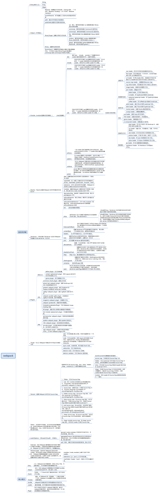

&#8195;&#8195;<该思维导图是根据`<<深入浅出webpack>>`章节大纲总结出来的。通过阅读这本书梳理webpack所包含的知识点，了解了webpack（版本为4.X）的相关配置，以及loader和plugin的原理以及编写。思维导图能够很形象的描述出各知识点之间的关系，同时也能加深知识点在我们心中的印象。画此思维导图的目的也是为了供以后自己复习用的。



### 1、webpack的作用

&#8195;&#8195;webpack的主要作用是构建，把源代码转换成发布到线上的可执行 JavaScrip、CSS、HTML 代码。在构建的过程中主要做了这几方面的功能。

- 代码转换：将非js文件如 TS 转换成 js，将 scss 转换成 css（Loaderclear）；
- 文件优化：压缩 js、css、html、压缩合并图片（plugin如uglify）。
- 代码分割：提取多个页面的公共代码，提取首屏不需要加载的代码让其异步加载（commons-chunk-plugin）。
- 模块合并：将模块分类合并成一个文件。
- 自动刷新：监听本地代码的变化，自动重新构建、并刷新浏览器（**配置文件watch和watchOPtions及热更新plugin**）。
- 代码校验：代码提交到仓库之前需要校验代码是否符合规范，以及单元测试是否通过。
- 自动发布：更新完代码后，自动构建出线上发布代码并传输到发布系统。


### 2、webpack核心概念

+ Entry：入口，Webpack 执行构建的第一步将从 Entry 开始，可抽象成输入。
+ Output:出口，告诉 webpack 在哪里输出它所创建的 bundles，以及如何命名这些文件，默认值为 ./dist。
+ Module：模块，在 Webpack 里一切皆模块，一个模块对应着一个文件。Webpack 会从配置的 Entry 开始递归找出所有依赖的模块。
+ Chunk：代码块，一个 Chunk 由多个模块组合而成，用于代码合并与分割。
+ Loader：模块转换器，用于把模块原内容按照需求转换成新内容。
+ Plugin：扩展插件，在 Webpack 构建流程中的特定时机会广播出对应的事件，插件可以监听这些事件的发生，在特定时机做对应的事情。

### 3、webpack的常见配置

**3.1 Entry**

&#8195;&#8195;构建的入口，Webpack 执行构建的第一步将从 Entry 开始，可抽象成输入。通过搜寻及递归找出所有入口所依赖的模块。**Entry 主要有 String、Array 和 Object 三种类型**。如果为 Array 类型时，搭配 output.library 配置项使用时，只有数组里的最后一个入口文件的模块会被导出。
- 如果 entry 是一个 string或者array，就只会生成一个 Chunk，这时 Chunk 的名称是 main 。
- 如果 entry 是一个 object ，就可能会出现多个 Chunk，这时 Chunk 的名称是 object 键值对中键的名称。
```javascript
    module.exports={
        entry:'./app/entry',	//入口模块的文件路径，可以是相对路径。
        entry:['./app/entry1', './app/entry2'],//入口模块的文件路径，可以是相对路径。只有1个入口,两个入口文件
        entry:{ 
            a: './app/entry-a', b: ['./app/entry-b1', './app/entry-b2']
            //配置多个入口，每个入口生成一个 Chunk。两个入口。
        },
    }
```
&#8195;&#8195;有时候由于项目需要，可能需要构建多个页面入口。除了上面的静态页面入口配置，还可以动态配置页面入口。一般有如下两种方式。
```javascript
    //同步函数
    entry: () => {
      return {
        index: "@/pages/index",
        user: "@pages/user"
      };
    };
    //异步函数
    entry: () => {
      return new Promise((resolve)=>{
        resolve({
           a:'./pages/a',
           b:'./pages/b',
        });
      });
    };
```

**3.2 Output**：

&#8195;&#8195;配置如何输出最终想要的代码。output 是一个 object，里面包含一系列配置项，下面分别介绍它们。
+ filename:输出文件的名称，为string 类型。 
+ chunkFilename: 配置无入口的 Chunk 在输出时的文件名称。chunkFilename 只用于指定在运行过程中生成的 Chunk 在输出时的文件名称.常见的会在运行时生成 Chunk 场景有在使用 **CommonChunkPlugin、使用 import('path/to/module')** 动态加载等时。 
+ path:输出文件存放在本地的目录，必须是 string 类型的绝对路径。通常通过 Node.js 的 path 模块去获取绝对路径。
+ publicPath:加载异步资源对应的 URL 地址。一般为CDN地址。通常用于配置发布到线上资源的 URL 前缀，为string 类型。 默认值是空字符串 ''，即使用相对路径。**output.path 和 output.publicPath 都支持字符串模版，内置变量只有一个：hash 代表一次编译操作的 Hash 值。**
+ libraryTarget：配置以何种方式导出库。是字符串的枚举类型。通常搭配target使用。通常有var、commonjs、commonjs2、this、window和global等值。
+ target：配置导出库的名称。
```javascript
  module.exports={
      ...
      output:{
          //如果只有一个输出文件，则可以把它写成静态不变的。
          filename:'bundle.js',
          //多个 Chunk 要输出时,可以根据 Chunk 的名称来区分输出的文件名
          filename: '[name].js',//可以将[name]看成字符串模板函数。该name为内置的哈希值。
          chunkFilename:[name].js，
          path: path.resolve(__dirname, 'dist');
          publicPath：'https://cdn.example.com/assets/'，
          libraryTarget:var
          
      }
  }
```
内置变量主要有以下这些：
+ id：	Chunk 的唯一标识，从0开始。
+ name：	Chunk 的名称。
+ hash：	Chunk 的唯一标识的 Hash 值。
+ chunkhash：	Chunk 内容的 Hash 值。

**3.3 Module**

&#8195;&#8195;模块，在 Webpack 里一切皆模块，一个模块对应着一个文件。Webpack 会从配置的 Entry 开始递归找出所有依赖的模块。主要有这些配置项。
+ rules：用来**配置模块的读取和解析规则**，通常用来配置 loader，是一个数组。配置一项 rule 一般是通过以下几项来完成的。
+ noParse：忽略的文件。
```javascript
    module.exports={
        ...
        module:{
            //让 Webpack 忽略对部分没采用模块化的文件的递归解析和处理。
            noParse： /jquery|chartjs/
            // 从 webpack 3.0.0 开始，也可以是函数
            noParse: function(content) {
               return /jquery|lodash/.test(content);
            },
            rules:[
                {
                    test: /\.js$/,//转码执行后缀的文件，一般是正则表达式。可为数组
                    use: ['babel-loader?cacheDirectory'],//?cacheDirectory 表示传给 babel-loader 的参数，用于缓存 babel 编译结果加快重新编译速度。是loader 属性的简写方式.（如：use: [ { loader: "style-loader "} ]）。
                    include:path.resolve(__dirname,"src"),//只命中src文件夹下的就是文件。可为数组
                    //解析选项对象。可以更细粒度的配置哪些模块语法要解析哪些不解析
                    parser:{
                        amd: false, // 禁用 AMD
                        commonjs: false, // 禁用 CommonJS
                        system: false, // 禁用 SystemJS
                        harmony: false, // 禁用 ES2015 Harmony import/export
                        requireInclude: false, // 禁用 require.include
                        requireEnsure: false, // 禁用 require.ensure
                        requireContext: false, // 禁用 require.context
                        browserify: false, // 禁用特殊处理的 browserify bundle
                        requireJs: false, // 禁用 requirejs.*
                        node: false, // 禁用 __dirname, __filename, module, require.extensions, require.main 等。
                        node: {...} // 在模块级别(module level)上重新配置 node 层(layer)
                    },
                    exclude:path.resolve(__dirname,'node_modules'),//排除node_module文件夹下的js文件。可为数组。
                    
                },
                {
                    test: /\.scss$/,
                    // 使用一组 Loader 去处理 SCSS 文件。处理顺序为从后到前，即先交给 sass-loader 处理，再把结果交给 css-loader 最后再给 style-loader。
                    use: ['style-loader', 'css-loader', 'sass-loader'],
                    // 排除 node_modules 目录下的文件
                    exclude: path.resolve(__dirname, 'node_modules'),
                },
                {   
                    test: /\.js$/
                    use:[
                        loader:'babel-loader',
                        //在 Loader 需要传入很多参数时，你还可以通过一个 Object 来描述。
                        options:{
                          cacheDirectory:true,
                        },
                        // enforce:'post' 的含义是把该 Loader 的执行顺序放到最后。 enforce 的值还可以是 pre，代表把 Loader 的执行顺序放到最前面
                        enforce:'post'
                    ]
                 },
                 //loader还可以采用链式写法。loader从右到左的被调用
                 {
                    test:/\.css$/
                     use: [
                      'style-loader',
                      {
                        loader: 'css-loader',
                        //
                        options: {
                          importLoaders: 1
                        }
                      },
                      {
                        loader: 'less-loader',
                        options: {
                          noIeCompat: true
                        }
                      }
                    ]
                 }
            ]
        }
    }
```

**3.4 Resolve**

&#8195;&#8195;Resolve 配置 Webpack 如何寻找模块所对应的文件。设置模块如何被解析。

```javascript
    module.exports={
        ...
        resolve:{
            //通过别名来把原导入路径映射成一个新的导入路径
            alias:{
                'components': './src/components/',
                '@':"./src",
                 ~:"./src",
                'vue$': 'vue/dist/vue.esm.js',
            }
            //指定一个字段，例如 browser(浏览器环境)，根据此规范进行解析。只会使用找到的第一个
            aliasFields:['browser', 'main']
            descriptionFiles:["package.json"],//描述文件
            enforceExtension:false,//是否强制扩展名
            extensions:[".js",".json"],//自动解析的扩展,导入语句没带文件后缀时，Webpack 会自动带上后缀后去尝试访问文件是否存在.
            modules：['./src/components','node_modules'],//告诉 webpack 解析模块时应该搜索的目录。绝对路径和相对路径都能使用。
        }
    }
```

**3.5 Plugins**

&#8195;&#8195;用于以各种方式自定义 webpack 构建过程。通过在webpack构建过程中，通过在特定的事件阶段，注入相应的逻辑来达到想要的效果。<br>

```javascript
    module.exports={
        ...
        plugins:[
            // 显示出被替换模块的名称
            new NamedModulesPlugin(),
             //定义全局环境变量的值
            new DefinePlugin({
              // 定义 NODE_ENV 环境变量为 production
              'process.env': {
                NODE_ENV: JSON.stringify('production')
              }
            }),
            //清除文件夹（在打包时使用）
            new CleanWebpackPlugin(['dist']),
            //生成模板文件，生成默认开始页面的文件，默认为index.html
            new HtmlWebpackPlugin({
              title: 'Output Management',
              filename:"index.html",
              template:"index.html",
              inject:true,//将所有的资源注入到template指定的index.html中。
              
            }),
            //压缩代码（只在生产环境下使用）
            new UglifyJSPlugin({
              cache:true,//是否使文件缓存
              parallel: true,//并行压缩代码
              sourceMap:true,//是否为打包后的代码生成源码
              compress: {
                // 在UglifyJs删除没有用到的代码时不输出警告
                warnings: false,
                // 删除所有的 `console` 语句，可以兼容ie浏览器
                drop_console: true,
                // 内嵌定义了但是只用到一次的变量
                collapse_vars: true,
                // 提取出出现多次但是没有定义成变量去引用的静态值
                reduce_vars: true,
                dead_code:true,//删除无用代码
              },
              output: {
                // 最紧凑的输出
                beautify: false,
                // 删除所有的注释
                comments: false,
              }
            }),
            //Scope Hoisting 作用域提升，使得代码体积更小，内存开销也更小 ,
            new ModuleConcatenationPlugin(),
            //在 Webpack 输出最终的代码之前，对这些代码进行优化
            new PrepackWebpackPlugin(),
            // 生成动态链接库文件，一般会单独新建dll.config.js文件，调用此插件，把一些公共常用的第三方模块打包成一个动态链接库。动态链接库只需要编译一次，在之后的构建过程中被动态链接库包含的模块将不会在重新编译，而是直接使用动态链接库中的代码。
            new DllPlugin({
              // 动态链接库的全局变量名称，需要和 output.library 中保持一致
              // 该字段的值也就是输出的 manifest.json 文件 中 name 字段的值
              // 例如 react.manifest.json 中就有 "name": "_dll_react"
              name: '_dll_[name]',
              // 描述动态链接库的 manifest.json 文件输出时的文件名称
              path: path.join(__dirname, 'dist', '[name].manifest.json'),
            }),
            // 告诉 Webpack 使用了哪些动态链接库
            new DllReferencePlugin({
              // 描述 react 动态链接库的文件内容
              manifest: require('./dist/react.manifest.json'),
            }),
            // 该插件的作用就是实现模块热替换，实际上当启动时带上 `--hot` 参数，会注入该插件，生成 .hot-update.json 文件。
            new HotModuleReplacementPlugin(),
            //自动加载模块，而不必到处 import 或 require 。
            new webpack.ProvidePlugin({
              $: 'jquery',
              jQuery: 'jquery'
            })
        ]
    }
```

**3.6 DevServer**

&#8195;&#8195;此配置项为webpack-dev-server的专有配置项。除了在DevServer中进行配置外，还可以通过命令行参数传入。
```javascript
    module.exports={
        ...
        devServer:{
            hot:true,//是否启用 webpack 的模块热替换功能。DevServer 默认的行为是在发现源代码被更新后会通过自动刷新整个页面来做到实时预览，开启模块热替换功能后将在不刷新整个页面的情况下通过用新模块替换老模块来做到实时预览。
            inline:true,//DevServer 的实时预览功能依赖一个注入到页面里的代理客户端去接受来自 DevServer 的命令和负责刷新网页的工作。inline 用于配置是否自动注入这个代理客户端到将运行在页面里的 Chunk 里去，默认是会自动注入。
            contentBase:"",//配置 DevServer HTTP 服务器的文件根目录。 默认情况下为当前执行目录，通常是项目根目录.
            //可以在 HTTP 响应中注入一些 HTTP 响应头，
            headers:{
                'X-foo':'bar'
            },
            host:127.0.0.1,//配置监听地址
            port:8080,//配置监听端口号
            open:true,//是否自动打开浏览器，
            openPage:"index.html",//配置浏览器自启时的网页
            allowedHosts： [
              'host.com',
              'subdomain.host.com',
              'subdomain2.host.com',
              'host2.com'
            ],//配置一个白名单列表，只有 HTTP 请求的 HOST 在列表里才正常返回
            compress:true,//是否开启gzip压缩。默认为false
            //展示编译信息
            overlay: {
              warnings: true,
              errors: true
            },
            quiet:true,//启用 quiet 后，除了初始启动信息之外的任何内容都不会被打印到控制台。这也意味着来自 webpack 的错误或警告在控制台不可见。
            //设置前端代理，访问后台
            
            stats:"errors-only",//控制展示webpack构建信息
            proxy:{
                "/api": "http://localhost:3000",//表示后端服务接口地址为http://localhost:3000/api
            },
            //配置多个代理路径
            proxy: [{
              context: ["/auth", "/api"],
              target: "http://localhost:3000",
            }],
            public:"myapp.test:80",//当启用内联模式时（inline：true），内联的客户端脚本所在的目录。
            public："/assets/",//此路径下的打包文件可在浏览器中访问.http://localhost:8080/assets/bundle.js可以范围打包后的bundle.js文件。
            
        }
    }
```

**3.7 其他常见配置项**

+ devtool：配置 Webpack 如何生成 Source Map。有很多配置项。可以使用SourceMapDevToolPlugin插件来替换该配置，进行更细粒度的控制。
+ target：webpack 能够为多种环境或 target 构建编译。webpack 为目标(target)指定一个环境。target 的取值可以为 web（默认，浏览器环境）、node（node 环境，使用 require 加载 chunk 代码，此时源码中的 require("fs")中的方式模块不会打包到 chunk 里）、async-node（异步加载 chunk 代码）、webworker、electron-main、electron-renderer。
+ watch：false,为true时表示启用 Watch 模式。这意味着在初始构建之后，webpack 将继续监听任何已解析文件的更改。Watch 模式默认关闭。**在使用 DevServer 时，监听模式默认是开启的。**
+ watchOptions：在watch为true时，才有效。

```javascript

    module.exports={
        ...
        devtool:"cheap-source-map", //转换过的代码（仅限行)
        devtool:"cheap-source-map",//原始源代码
        //开发环境的配置
        devtool:"eval",//生成后的代码 ,每个模块相互分离，并用模块名称进行注释。
        devtool:"eval-source-map",//原始源代码
        devtool:"cheap-eval-source-map",//转换过的代码（仅限行），它会忽略源自 loader 的 source map，并且仅显示转译后的代码
        devtool:"cheap-module-eval-source-map",//原始源代码（仅限行），源自 loader 的 source map 会得到更好的处理结果
        //生产环境的配置
        devtool:(none),//省略该项配置 //打包后的代码,所有生成的代码视为一大块代码。你看不到相互分离的模块。
        devtool:"source-map", //原始源代码，便于调试。它为 bundle 添加了一个引用注释，以便开发工具知道在哪里可以找到它。
        devtool:"hidden-source-map",//与 source-map 相同，但不会为 bundle 添加引用注释。如果你只想 source map 映射那些源自错误报告的错误堆栈跟踪信息，但不想为浏览器开发工具暴露你的 source map，这个选项会很有用。
        devtool:"nosources-source-map",//创建的 source map 不包含 sourcesContent(源代码内容)。它可以用来映射客户端上的堆栈跟踪，而无须暴露所有的源代码。
        target："web",//默认值，浏览器环境
        target："node",//node环境
        watch:true,//在使用 DevServer 时，监听模式默认是开启的。
        //在watch配置为true时，下面的配置项才会生效。
        watchOptions：{
            ignored: /node_modules/,//不监听的文件夹
            aggregateTimeout：300,//监听到变化发生后会等300ms再去执行动作，防止文件更新太快导致重新编译频率太高
            poll：1000,//多久轮询一次
        }
    }
```
+ externals：防止将某些 import 的包(package)打包到 bundle 中，而是在运行时(runtime)再去从外部获取这些扩展依赖。
```javascript
    //在index.html以外联脚本的方式引入脚本文件
    <script
      src="https://code.jquery.com/jquery-3.1.0.js"
      integrity="sha256-slogkvB1K3VOkzAI8QITxV3VzpOnkeNVsKvtkYLMjfk="
      crossorigin="anonymous">
    </script>
    //在配置文件中就可以通过如下配置，不讲jquery打包。
    module.exports={
        ...
        externals: {
          //string类型
          $: 'jQuery',
          //Array类型
          subtract: ['./math', 'subtract'],//表示的是。用subtract去代替./math/subtract方法。
          //Object类型
          lodash : {
            commonjs: "lodash",
            amd: "lodash",
            root: "_" // 指向全局变量
          }

        }
    }
```
+ performance：这些选项可以控制 webpack 如何通知「资源(asset)和入口起点超过指定文件限制」。
+ stat：webpack构建时的统计信息。
+ node:配置是否 polyfill 或 mock 某些 Node.js 全局变量和模块。这可以使最初为 Node.js 环境编写的代码，在其他环境（如浏览器）中运行。此功能由 webpack 内部的 NodeStuffPlugin 插件提供。
```javascript
    module.exports={
        performance：{
            maxEntrypointSize: 400000,//默认值是：250000 (bytes)。入口起点文件的最大体积。控制 webpack 何时生成性能提示.
            maxAssetSize：100000,//资源(asset)是从 webpack 生成的任何文件,控制 webpack 何时生成性能提示。默认值是：250000 (bytes)。
            hints:false | "error" | "warning",//打开或关闭提示。此属性默认设置为 "warning"。可以以提醒或错误的方式提醒你文件大小是否超过你设置的大小。
            //对提示文件进行一个过滤。
            assetFilter: function(assetFilename) {
                return assetFilename.endsWith('.js');
            }
        },
        stas:{
            // `webpack --colors` 等同于
            colors: false,
            // 添加错误的详细信息（就像解析日志一样）
            errorDetails: true,
            // 添加时间信息
            timings: true,
            // 添加 webpack 版本信息
            version: true,
        },
        //以下是默认值。从 webpack 3.0.0 开始，node 选项可能被设置为 false，以完全关闭 NodeStuffPlugin 和 NodeSourcePlugin 插件。
        node:{
            console: false,// 什么都不提供。预期获取此对象的代码，可能会因为获取不到此对象，触发 ReferenceError 而崩溃
            global: true,//为true时表示提供 polyfill。
            process: true,
            __filename: "mock",//提供 mock 实现预期接口，但功能很少或没有。
            __dirname: "mock",
            Buffer: true,
            setImmediate: true,
        }
    }
```
**3.8 整体配置**
```javascript
    module.exports={
        context:__dirname, // Webpack 使用的根目录，入口文件所处的目录的绝对路径的字符串。
        /********entry配置*******/
        entry:'./app/entry',	//入口模块的文件路径，可以是相对路径。
        entry:['./app/entry1', './app/entry2'],//入口模块的文件路径，可以是相对路径。只有1个入口,两个入口文件
        entry:{ 
            a: './app/entry-a', b: ['./app/entry-b1', './app/entry-b2']
            //配置多个入口，每个入口生成一个 Chunk。两个入口。
        },
        //同步函数
        entry: () => {
          return {
            index: "@/pages/index",
            user: "@pages/user"
          };
        };
        //异步函数
        entry: () => {
          return new Promise((resolve)=>{
            resolve({
               a:'./pages/a',
               b:'./pages/b',
            });
          });
        },
        /********entry配置*******/
        /********output配置*******/
        output:{
             //如果只有一个输出文件，则可以把它写成静态不变的。
            filename:'bundle.js',
            //多个 Chunk 要输出时,可以根据 Chunk 的名称来区分输出的文件名
            filename: '[name].js',//可以将[name]看成字符串模板函数。该name为内置的哈希值。
            filename: '[chunkhash].js', // 根据文件内容 hash 值生成文件名称，用于浏览器长时间缓存文件
            chunkFilename:[name].js,//配置无入口的 Chunk 在输出时的文件名称。常见的会在运行时生成 Chunk 场景有在使用 CommonChunkPlugin、使用 import('path/to/module') 动态加载等时。
            sourceMapFilename: "[file].map",//此选项会向硬盘写入一个输出文件，只在 devtool 启用了 SourceMap 选项时才使用。
            path: path.resolve(__dirname, 'dist');//输出文件存放在本地的目录
            publicPath：'https://cdn.example.com/assets/',//加载异步资源对应的 URL 地址。
            publicPath:"/dist",//放到指定目录下
            publicPath："",//放到根目录下
            //配置以何种方式导出库。注意，此选项与分配给 output.library 的值一同使用
            libraryTarget:"var",//（默认值）当 library 加载完成，入口起点的返回值将分配给一个变量：
            libraryTarget: "this",//入口起点的返回值将分配给 this 的一个属性（此名称由 output.library 定义）
            libraryTarget: "window",//分配给 window 对象
            libraryTarget: "global",//分配给 global 对象
            libraryTarget: "commonjs",//入口起点的返回值将使用 output.library 中定义的值，分配给 exports 对象。
            libraryTarget: "commonjs2",//入口起点的返回值将分配给 module.exports 对象
            libraryTarget: "amd",//将你的 library 暴露为 AMD 模块。
            libraryTarget: "umd",//将你的 library 暴露为所有的模块定义下都可运行的方式
            library: "MyLibrary",
            ...
        },
         /********output配置*******/
         /********module配置*******/
        module:{
            //让 Webpack 忽略对部分没采用模块化的文件的递归解析和处理。
            noParse： /jquery|chartjs/
            // 从 webpack 3.0.0 开始，也可以是函数
            noParse: function(content) {
               return /jquery|lodash/.test(content);
            },
            rules:[
                {
                    test: /\.js$/,//转码执行后缀的文件，一般是正则表达式。可为数组
                    use: ['babel-loader?cacheDirectory'],//?cacheDirectory 表示传给 babel-loader 的参数，用于缓存 babel 编译结果加快重新编译速度。是loader 属性的简写方式.（如：use: [ { loader: "style-loader "} ]）。
                    include:path.resolve(__dirname,"src"),//只命中src文件夹下的就是文件。可为数组
                    //解析选项对象。可以更细粒度的配置哪些模块语法要解析哪些不解析
                    parser:{
                        amd: false, // 禁用 AMD
                        commonjs: false, // 禁用 CommonJS
                        system: false, // 禁用 SystemJS
                        harmony: false, // 禁用 ES2015 Harmony import/export
                        requireInclude: false, // 禁用 require.include
                        requireEnsure: false, // 禁用 require.ensure
                        requireContext: false, // 禁用 require.context
                        browserify: false, // 禁用特殊处理的 browserify bundle
                        requireJs: false, // 禁用 requirejs.*
                        node: false, // 禁用 __dirname, __filename, module, require.extensions, require.main 等。
                        node: {...} // 在模块级别(module level)上重新配置 node 层(layer)
                    },
                    exclude:path.resolve(__dirname,'node_modules'),//排除node_module文件夹下的js文件。可为数组。
                    
                },
                {
                    test: /\.scss$/,
                    // 使用一组 Loader 去处理 SCSS 文件。处理顺序为从后到前，即先交给 sass-loader 处理，再把结果交给 css-loader 最后再给 style-loader。
                    use: ['style-loader', 'css-loader', 'sass-loader'],
                    // 排除 node_modules 目录下的文件
                    exclude: path.resolve(__dirname, 'node_modules'),
                },
                {   
                    test: /\.js$/,
                    //use等同loaders
                    use:[
                        loader:'babel-loader',
                        //在 Loader 需要传入很多参数时，你还可以通过一个 Object 来描述。
                        options:{
                          cacheDirectory:true,
                        },
                        // enforce:'post' 的含义是把该 Loader 的执行顺序放到最后。 enforce 的值还可以是 pre，代表把 Loader 的执行顺序放到最前面
                        enforce:'post'
                    ]
                 },
                 //loader还可以采用链式写法。loader从右到左的被调用
                 {
                    test:/\.css$/
                     use: [
                      'style-loader',
                      {
                        loader: 'css-loader',
                        //
                        options: {
                          importLoaders: 1
                        }
                      },
                      {
                        loader: 'less-loader',
                        options: {
                          noIeCompat: true
                        }
                      }
                    ]
                 }
            ]
        },
        // 配置插件
        plugins: [
             //定义全局环境变量的值
            new DefinePlugin({
              // 定义 NODE_ENV 环境变量为 production
              'process.env': {
                NODE_ENV: JSON.stringify('production')
              }
            }),
            //清除文件夹（在打包时使用）
            new CleanWebpackPlugin(['dist']),
            //生成模板文件，生成默认开始页面的文件，默认为index.html
            new HtmlWebpackPlugin({
              title: 'Output Management',
              filename:"index.html",
              template:"index.html",
              inject:true,//将所有的资源注入到template指定的index.html中。
              
            }),
            //压缩代码（只在生产环境下使用）
            new UglifyJSPlugin({
              cache:true,//是否使文件缓存
              parallel: true,//并行压缩代码
              sourceMap:true,//是否为打包后的代码生成源码
              compress: {
                // 在UglifyJs删除没有用到的代码时不输出警告
                warnings: false,
                // 删除所有的 `console` 语句，可以兼容ie浏览器
                drop_console: true,
                // 内嵌定义了但是只用到一次的变量
                collapse_vars: true,
                // 提取出出现多次但是没有定义成变量去引用的静态值
                reduce_vars: true,
                dead_code:true,//删除无用代码
              },
              output: {
                // 最紧凑的输出
                beautify: false,
                // 删除所有的注释
                comments: false,
              }
            }),
            //Scope Hoisting 作用域提升，使得代码体积更小，内存开销也更小 ,
            new ModuleConcatenationPlugin(),
            //在 Webpack 输出最终的代码之前，对这些代码进行优化
            new PrepackWebpackPlugin(),
            // 生成动态链接库文件，一般会单独新建dll.config.js文件，调用此插件，把一些公共常用的第三方模块打包成一个动态链接库。动态链接库只需要编译一次，在之后的构建过程中被动态链接库包含的模块将不会在重新编译，而是直接使用动态链接库中的代码。
            new DllPlugin({
              // 动态链接库的全局变量名称，需要和 output.library 中保持一致
              // 该字段的值也就是输出的 manifest.json 文件 中 name 字段的值
              // 例如 react.manifest.json 中就有 "name": "_dll_react"
              name: '_dll_[name]',
              // 描述动态链接库的 manifest.json 文件输出时的文件名称
              path: path.join(__dirname, 'dist', '[name].manifest.json'),
            }),
            // 告诉 Webpack 使用了哪些动态链接库
            new DllReferencePlugin({
              // 描述 react 动态链接库的文件内容
              manifest: require('./dist/react.manifest.json'),
            }),
            // 该插件的作用就是实现模块热替换，实际上当启动时带上 `--hot` 参数，会注入该插件，生成 .hot-update.json 文件。
            new HotModuleReplacementPlugin(),
            //自动加载模块，而不必到处 import 或 require 。
            new webpack.ProvidePlugin({
              $: 'jquery',
              jQuery: 'jquery'
            })
        ],
        // 配置寻找模块的规则
        resolve:{
            //通过别名来把原导入路径映射成一个新的导入路径
            alias:{
                'components': './src/components/',
                '@':"./src",
                 ~:"./src",
                'vue$': 'vue/dist/vue.esm.js',
            }
            //指定一个字段，例如 browser(浏览器环境)，根据此规范进行解析。只会使用找到的第一个
            aliasFields:['browser', 'main']
            descriptionFiles:["package.json"],//描述文件
            enforceExtension:false,//是否强制扩展名
            extensions:[".js",".json"],//自动解析的扩展,导入语句没带文件后缀时，Webpack 会自动带上后缀后去尝试访问文件是否存在.
            modules：['./src/components','node_modules'],//告诉 webpack 解析模块时应该搜索的目录。绝对路径和相对路径都能使用。  
        },
        //开发模式下的服务器配置
        devServer:{
            hot:true,//是否启用 webpack 的模块热替换功能。DevServer 默认的行为是在发现源代码被更新后会通过自动刷新整个页面来做到实时预览，开启模块热替换功能后将在不刷新整个页面的情况下通过用新模块替换老模块来做到实时预览。
            inline:true,//DevServer 的实时预览功能依赖一个注入到页面里的代理客户端去接受来自 DevServer 的命令和负责刷新网页的工作。inline 用于配置是否自动注入这个代理客户端到将运行在页面里的 Chunk 里去，默认是会自动注入。
            contentBase:"",//配置 DevServer HTTP 服务器的文件根目录。 默认情况下为当前执行目录，通常是项目根目录.
            //可以在 HTTP 响应中注入一些 HTTP 响应头，
            headers:{
                'X-foo':'bar'
            },
            host:127.0.0.1,//配置监听地址
            port:8080,//配置监听端口号
            open:true,//是否自动打开浏览器，
            openPage:"index.html",//配置浏览器自启时的网页
            allowedHosts： [
              'host.com',
              'subdomain.host.com',
              'subdomain2.host.com',
              'host2.com'
            ],//配置一个白名单列表，只有 HTTP 请求的 HOST 在列表里才正常返回
            compress:true,//是否开启gzip压缩。默认为false
            //展示编译信息
            overlay: {
              warnings: true,
              errors: true
            },
            quiet:true,//启用 quiet 后，除了初始启动信息之外的任何内容都不会被打印到控制台。这也意味着来自 webpack 的错误或警告在控制台不可见。
            //设置前端代理，访问后台
            
            stats:"errors-only",//控制展示webpack构建信息
            proxy:{
                "/api": "http://localhost:3000",//表示后端服务接口地址为http://localhost:3000/api
            },
            //配置多个代理路径
            proxy: [{
              context: ["/auth", "/api"],
              target: "http://localhost:3000",
            }],
            public:"myapp.test:80",//当启用内联模式时（inline：true），内联的客户端脚本所在的目录。
            public："/assets/",//此路径下的打包文件可在浏览器中访问.http://localhost:8080/assets/bundle.js可以范围打包后的bundle.js文件。  
        },
        //source map配置
        devtool:"cheap-source-map", //转换过的代码（仅限行)
        devtool:"cheap-source-map",//原始源代码
        //开发环境的配置
        devtool:"eval",//生成后的代码 ,每个模块相互分离，并用模块名称进行注释。
        devtool:"eval-source-map",//原始源代码
        devtool:"cheap-eval-source-map",//转换过的代码（仅限行），它会忽略源自 loader 的 source map，并且仅显示转译后的代码
        devtool:"cheap-module-eval-source-map",//原始源代码（仅限行），源自 loader 的 source map 会得到更好的处理结果
        //生产环境的配置
        devtool:(none),//省略该项配置 //打包后的代码,所有生成的代码视为一大块代码。你看不到相互分离的模块。
        devtool:"source-map", //原始源代码，便于调试。它为 bundle 添加了一个引用注释，以便开发工具知道在哪里可以找到它。
        devtool:"hidden-source-map",//与 source-map 相同，但不会为 bundle 添加引用注释。如果你只想 source map 映射那些源自错误报告的错误堆栈跟踪信息，但不想为浏览器开发工具暴露你的 source map，这个选项会很有用。
        devtool:"nosources-source-map",//创建的 source map 不包含 sourcesContent(源代码内容)。它可以用来映射客户端上的堆栈跟踪，而无须暴露所有的源代码。
        externals: { // 使用来自 JavaScript 运行环境提供的全局变量
            //string类型
            $: 'jQuery',
            //Array类型
            subtract: ['./math', 'subtract'],//表示的是。用subtract去代替./math/subtract方法。
            //Object类型
            lodash : {
                commonjs: "lodash",
                amd: "lodash",
                root: "_" // 指向全局变量
            }
        },
        // 配置输出代码的运行环境
        target: 'web', // 浏览器，默认
        target: 'webworker', // WebWorker
        target: 'node', // Node.js，使用 `require` 语句加载 Chunk 代码
        target: 'async-node', // Node.js，异步加载 Chunk 代码
        target: 'node-webkit', // nw.js
        target: 'electron-main', // electron, 主线程
        target: 'electron-renderer', // electron, 渲染线程
        //开启监听模式
        watch:true,//在使用 DevServer 时，监听模式默认是开启的。
        //在watch配置为true时，下面的配置项才会生效。
        watchOptions：{
            ignored: /node_modules/,//不监听的文件夹
            aggregateTimeout：300,//监听到变化发生后会等300ms再去执行动作，防止文件更新太快导致重新编译频率太高
            poll：1000,//多久轮询一次
        }
        stats: { // 控制台输出日志控制,webpack构建时的统计信息。
            assets: true,//添加资源信息
            colors: true,// `webpack --colors` 等同于
            errors: true,//输出错误信息
            errorDetails: true,//// 添加错误的详细信息（就像解析日志一样）
            hash: true,//添加 compilation 的哈希值
            version:true,//添加尾巴爬虫库版本信息
            performance: true,// 当文件大小超过 `performance.maxAssetSize` 时显示性能提示
            modules: true,// 添加构建模块信息,
            // 添加时间信息
            timings: true,

        },
        // 输出文件性能检查配置,这些选项可以控制 webpack 如何通知「资源(asset)和入口起点超过指定文件限制」。
        performance:{
            maxEntrypointSize: 400000,//默认值是：250000 (bytes)。入口起点文件的最大体积。控制 webpack 何时生成性能提示.
            maxAssetSize：100000,//资源(asset)是从 webpack 生成的任何文件,控制 webpack 何时生成性能提示。默认值是：250000 (bytes)。
            hints:false | "error" | "warning",//打开或关闭提示。此属性默认设置为 "warning"。可以以提醒或错误的方式提醒你文件大小是否超过你设置的大小。
            //对提示文件进行一个过滤。
            assetFilter: function(assetFilename) {
                return assetFilename.endsWith('.js');
            }  
        },
        
        //配置是否 polyfill 或 mock 某些 Node.js 全局变量和模块。这可以使最初为 Node.js 环境编写的代码，在其他环境（如浏览器）中运行。此功能由 webpack 内部的 NodeStuffPlugin 插件提供。
        node:{
            console: false,// 什么都不提供。预期获取此对象的代码，可能会因为获取不到此对象，触发 ReferenceError 而崩溃
            global: true,//为true时表示提供 polyfill。
            process: true,
            __filename: "mock",//提供 mock 实现预期接口，但功能很少或没有。
            __dirname: "mock",
            Buffer: true,
            setImmediate: true,
        }
      
    }
```

**3.9 多种配置类型**

&#8195;&#8195;配置文件除了以Object的形式输出以外，还可以以function或者promise的形式输出,同时还可以导出多个配置对象。
```javascript
    //以对象的形式,需要写多个配置文件以适应"开发和生产"模式
    module.exports={
        entry:"app.js",
        output:{
            
        },
        ...
    },
    //导出多个配置对象
    module.exports=[{
          output: {
            filename: './dist-amd.js',
            libraryTarget: 'amd'
          },
          entry: './app.js',
          mode: 'production',
        }, {
          output: {
            filename: './dist-commonjs.js',
            libraryTarget: 'commonjs'
          },
          entry: './app.js',
          mode: 'production',
        }]
    //以function的形式,采用导出一个 Function 的方式，能通过 JavaScript 灵活的控制配置，做到只用写一个配置文件就能完成以上要求。
    module.exports=function(env={},args){
        const isProduction=env["production"];
        const plugins=[];
        //返回的还是那些配置文件
        return {
            plugins: plugins,
            // 在生成环境不输出 Source Map
            devtool: isProduction ? undefined : 'source-map',
         };
    }
    //以promise的形式导出
    module.exports=function(env={},args){
        return new Promise(resolve,reject){
            setTimeout(() => {
              resolve({
                entry: './app.js',
                /* ... */
              })
            }, 5000)
        }
    }
    
```
以函数的形式导出配置文件时。
+ env：当前运行时的 Webpack **专属环境变量**，env 是一个 Object。设置它需要在启动 Webpack 时带上参数。例如启动命令是 webpack --env.production --env.bao=foo时，则 env 的值是 {"production":"true","bao":"foo"}。
+ args：代表在启动 Webpack 时所有通过命令行传入的参数。例如 --config、--env、--devtool、--progress、---watch，可以通过 webpack -h 列出所有 Webpack 支持的命令行参数。


