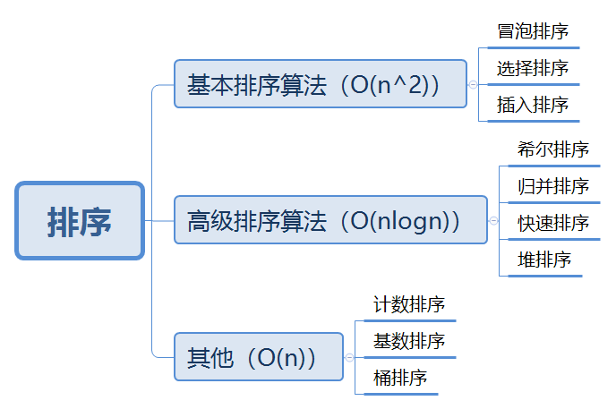
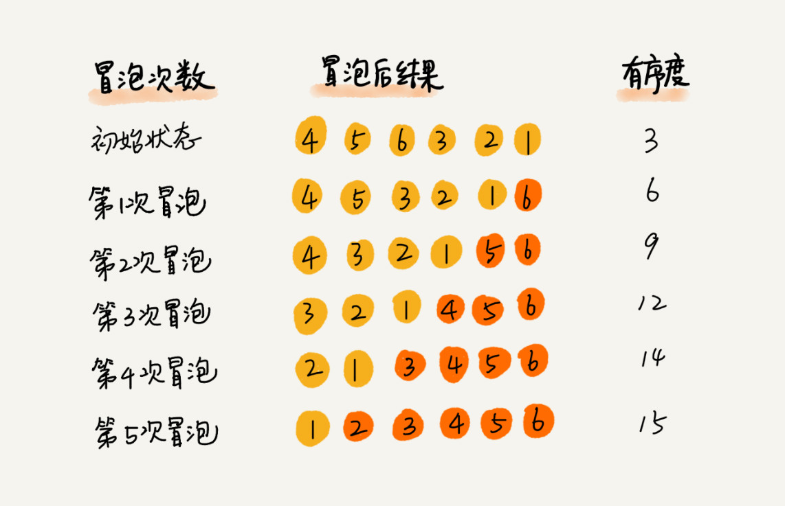

&#8195;&#8195;一直觉得做开发这一行，数据结构和算法是基础，基础不牢固，这一行注定走的不会太远。所以最近也是在花时间重新来学一下数据结构和算法，并以 `javascript` 来将这些算法来实现一遍，并在此学习记录下来。



## 1、衡量排序算法的几个指标

#### 1、排序的内存消耗

&#8195;&#8195;排序的内存消耗可以用空间复杂度来衡量，针对排序算法的空间复杂度，引入了**原地排序**
的概念，原地排序算法是指空间复杂度为`O(1)`的排序算法,指不会使用额外的内存空间。

#### 2、排序算法的稳定性
&#8195;&#8195;如果待排序的序列中存在值相等的元素,经过排序之后,**相等元素之间原有的先后顺序不变**，这称这种算法为**稳定的排序算法**，否则叫**不稳定的排序算法**。
&#8195;&#8195;**为什么要考察排序算法的稳定性？**
&#8195;&#8195;因为实际工作中，我们排序的可能是一组对象，我们需要按照对象的某个`key`来排序。假如现在要给一个对象数组排序。对象中有下单时间和订单金额两个属性。假如我们需要按金额从小到大排序，金额相同的对象按照时间来排序。可以先按照时间排序，然后借助稳定排序算法，按照订单金额重新排序。**稳定排序算法可以保证金额相同的两个对象，在排序之后的顺序不变**。

#### 3、有序度、逆序度和满有序度
&#8195;&#8195;**有序度**是数组中具有有序关系的元素对的个数。有序元素对用数学表达式表示就是`a[i]<a[j],且i<j`。`1,2,3,45`这样完全有序的数组的有序度称为**满有序度**。逆序元素对`a[i]<a[j],且i>j`。**逆序度=满有序度-有序度**

## 2、基本排序算法

这几种排序方法的时间复杂度都是`O(n^2)`。
#### 1、冒泡排序（Bubble Sort）
&#8195;&#8195;是最慢的排序算法之一，也是一种最容易实现的排序算法。  
&#8195;&#8195;基本原理：**两两比较相邻记录的关键字，如果反序则交换，直到没有反序的记录为止**。是一种交换排序。冒泡排序算法的时间复杂度是`O(n^2)`。 就是通过一次次的比较，将当前比较队列中的最小元素推到队首。或者是将当前比较队列这个的最大元素推到队尾。
冒泡算法是原地排序算法，同时也是稳定的排序算法。
```js
function bubbleSort (arr) {
    const len = arr.length;
    for (let i = 0; i < len; i++) {
        let flag = false;
        for (let j = 0; j<len-i-1 ; j++) {
            if (arr[j] > arr[j+1]) {
                //交换两者之间的位置
                [arr[j+1], arr[j]] = [arr[j+1], arr[j]]
                flag = true;
            }
        }
        if(!flag) break;
    }
}
//测试
const arr=[4,5,6,3,2,1];
bubbleSort(arr);
```
**排序分析如下：** 图片来源于网络


#### 2、选择排序（Selection Sort）
&#8195;&#8195;选择排序用一句话来描述就是**从为排序区间内选择出最小的元素，插入到已排序区间的末尾**。
&#8195;&#8195;选择排序算法的实现思路类似插入排序，也分**已排序区间和未排序区间**。每次会从未排序区间中找到最小的元素，将其放到已排序区间的末尾。简单选择排序的时间复杂度也是`O(n^2)`。选择排序也是**原地排序算法**，但是是一种**不稳定的排序算法**。比如`4,8,4,2,7`这样一组数组,第一次找到最小元素2，与第一个4交换位置，这样第一个4和中间4的顺序就变了。 所以相对于冒泡排序和插入排序，选择排序性能就稍微逊色了。选择排序包含两种操作：**元素的比较** 和 **元素的交换**    
&#8195;&#8195;通俗的将就是按从左到右的顺序指定一个位置放置（假定位置为`i`）最小的元素，然后从`i~n`中选出最小的元素，跟`i`位置的元素交换，然后`i`逐渐加一，这样不断循环下去，直到循环到队尾。
```js
function selectSort (arr) {
    const len = arr.length;
    let min;//表示当前循环最小的元素的位置
    //i是每次循环后放置最小元素的位置
    for (let i = 0; i < len - 1; i++) {
        min = i;
        //找到i到len-1之间最小的元素
        for (let j = i + 1; j < len; j++) {
            if (arr[min] > arr[j]) {
                min = j;
            }
        }
        //将i和min的位置进行交换
        i!= min&&swap(arr, i, min);
        console.log(arr);
    }
}
//测试
const arr=[4,5,6,3,2,1];
selectSort(arr);
```
**排序分析如下：** 图片来源于网络


#### 3、插入排序(Insert Sort)
&#8195;&#8195;插入排序用一句话来描述就是**将未排序区间的首个元素插入到已排序区间的合适位置**。  
&#8195;&#8195;将数组中的数据分为两个区间,**已排序区间**和**未排序区间**。插入排序算法的核心就是 **取未排序区间中的元素，在已排序区间中找到合适的位置将其插入，并保证已排区间数据一致有序**。插入排序也包含两种操作：**元素的比较**和**元素的移动**。
&#8195;&#8195;插入排序也是原地排序算法，同时也是稳定的排序算法。**插入排序性能优于冒泡排序(插入排序只需要移动一次元素，这冒泡需要移动三次)**
```js
function insertSort (arr) {
    const len = arr.length;
    let temp, i, j;
    for (i = 1; i < len; i++) {
        //临时存放要被比较的元素
        temp = arr[i];
        //取出未排序区间内的第一个元素，跟已排序区间的元素比较
        //判断左边元素是否比右边元素大，大的话就交换位置 
        for (j = i; j > 0&& arr[j - 1] > temp ; j--) {
            //数据移动 ，往后移动
            arr[j] = arr[j - 1];
        }
        //插入数据
        arr[j] = temp;
    }
    return arr;
}
//测试
const arr=[4,5,6,1,3,2];
insertSort(arr);
```
**输出结果分析：** 图片来源于网络

**总结**
+ **冒泡排序和插入排序是稳定排序，而选择排序不是。**
+ **三种排序都是原地插入排序。**
+ **性能:插入排序>冒泡排序>选择排序**

## 2、高级排序算法
这几种排序方法的时间复杂度都是`O(nlogn)`
#### 1、希尔排序
&#8195;&#8195;工作原理：通过定义一个间隔来表示排序过程中进行比较的元素之间有多远的间隔，然后比较这两个元素的大小进行交换排序，使得整个数据基本有序。最后间隔等于`1`时再进行交换排序。其时间复杂度为`O(n^3/2)`

```js
function shellSort (arr) {
    const len = arr.length;
    let i, j, h = len;
    while (h > 1) {
        //设置间隔
        h = parseInt(h / 3) + 1;
        //设置外层循环起点
        for (i = h; i < len; i++) {
            //将外层循环地点设置为内层循环终点，然后与左边相距间隔的元素进行比较，同时j要大于等于间隔
            for (j = i; j >= h && arr[j] < arr[j - h]; j -= h) {
                swap(arr, j, j - h);
            }
        }
    }
}
//测试
const arr= [61, 85, 19, 88, 68, 8, 70, 29]
shellSort(arr1);
```
#### 2、归并排序(Merge Sort)
&#8195;&#8195;**把一系列排好的子序列合并成一个大的完整有序序列**。将原始数组切分成较小的数组，直到每个小数组只有一项，然后在将小数组归并为排好序的较大数组，直到最后得到一个排好序的最大数组。
&#8195;&#8195;归并算法不需要两两比较，不存在跳跃，是一种比较稳定的排序算法。其时间复杂度是`O(nlogn)`。
```js
function mergeSort (arr) {
    const len = arr.length;
    let left, right, step = 1;//当step=1时，是将数组划分为只有一个元素的n个数组，为2、4...时开始合并
    while (step < len) {
        left = 0, right = step;
        //判断是否出界
        while (right + step < len) {
            mergeArray(arr, left, left + step, right, right + step, step);
            //重新设置初始值
            left = right + step;
            right = left + step;
        }
        //为了合并剩下没有被合并的
        if (right < len) {
            mergeArray(arr, left, left + step, right, len, step)
        }
        step *= 2;
    }
    return arr;
}
function mergeArray (arr, startLeft, stopLeft, startRight, stopRight, step) {
    const leftArr = new Array(stopLeft - startLeft + 1);
    const rightArr = new Array(stopRight - startRight + 1);
    //构建左子数组
    let k = startLeft;
    for (let i = 0; i < leftArr.length - 1; i++) {
        leftArr[i] = arr[k++]
    }
    //构建右子数组
    k = startRight;
    for (let i = 0; i < rightArr.length - 1; i++) {
        rightArr[i] = arr[k++];
    }
    leftArr[leftArr.length - 1] = Infinity;
    rightArr[rightArr.length - 1] = Infinity;
    let l = r = 0;
    console.log("left array - ", leftArr);
    console.log("right array - ", rightArr);
    //根据左右两边子数组数据的大小，对数组重新排序
    for (let p = startLeft; p < stopRight; p++) {
        if (leftArr[l] < rightArr[r]) {
            arr[p] = leftArr[l++];
        } else {
            arr[p] = rightArr[r++]
        }
    }
    console.log("arr - ", arr);
}
var nums = [6, 10, 9, 1, 4, 8, 2, 7, 3, 5];
mergeSort(nums);
```
#### 3、快速排序(Quick Sort)
&#8195;&#8195;基本思想就是通过一趟排序将待排序记录分割成独立的两部分，其中一部分记录的关键字均比另一部分记录的关键字小，则可分别对这两部分记录继续进行排序，已达到整个序列有序的目的。它是处理大数据最快的排序算法之一。    
&#8195;&#8195;这个算法首先要在列表中选择一个元素作为基准值（`pivot`）。数据排序围绕基准值进行， 将列表中小于基准值的元素移到数组的底部，将大于基准值的元素移到数组的顶部。时间复杂度为`nlogn`。 
```js
function quickSort (arr) {
    var len = arr.length;
    if (len == 0) return [];
    var leftArr = [];
    var rightArr = [];
    //选取基准值
    var pivot = arr[0];
    for (var i = 1; i < len; i++) {
        arr[i] < pivot ? leftArr.push(arr[i]) : rightArr.push(arr[i])
    }
    return [...quickSort(leftArr), pivot, ...quickSort(rightArr)]
}
```

&#8195;&#8195;归并排序和快速排序都用到了递归。在这里插入两个关于递归的概念———**尾递归和尾调用**

&#8195;&#8195;**尾递归：** 当递归调用是整个函数体中最后执行的语句且它的返回值不属于**表达式**的一部分时(**只有函数本身**)，这个递归就是尾递归(**尾调用自身**)。只需要维持一个对象上下文。
```js
//阶乘函数的递归，
function factorial(n) {
    if (n == 1) return res;
    return n*factorial2(n - 1)
}
//阶乘函数的尾递归
function factorial(n, res) {
    if (n == 1) return res;
    return factorial2(n - 1, n * res)
}
```
&#8195;&#8195;**尾调用：** 指函数内部的最后一个动作是函数调用，不属于表达式。该调用的返回值，直接返回给函数，即函数调用的返回值不需要再跟其他变量进行计算。只需要维持一个对象上下文。
```js
//尾调用，只需要维持一个调用栈
function test(n){
    return callc(n)
}
//非尾调用
function test(n){
    return callc(n)+1
}
```

#### 4、堆排序(Heap Sort)
&#8195;&#8195;是对简单选择排序的一种改进。  
&#8195;&#8195;堆是一棵完全二叉树。具有以下性质：
+ 每个结点的值都大于或等于其左右结点的值，称为**大顶堆**。
+ 每个结点的值都小于或等于其左右孩子结点的值，称为**小顶堆**。  

&#8195;&#8195;基本思想就是将待排序的序列构造成一个**大顶堆**。此时，整个序列的最大值，就是顶推的根结点。将它移走，然后将剩余的 `n-1` 个序列重新构成一个堆，这样就回得到 `n` 个元素中的次大值。如此反复执行，便能得到一个有序序列了。    
&#8195;&#8195;堆排序的时间复杂度为`O(nlogn)`。因为比较和交换是跳跃式进行，因此堆排序也是一种不稳定的排序方法。由于构建堆所需的比较次数较多，因此不适合排序序列个数较少的情况。

```js
function heapSort(arr){
    buildHeap(arr);
    let len=arr.length-1;
    while(len>0){
        //将堆顶元素放到最后排好序的数组的首位
        [arr[0],arr[len]]=[arr[len],arr[0]];
        len--;
        //将最大元素调整到堆顶
        heapify(arr,len,0)
    }
    console.log("排好序的数据",arr);
}
function buildHeap (arr) {
    const len = arr.length;
    //最后一个非叶子节点的索引
    let i = Math.floor(len / 2)-1;
    for (; i >= 0; i--) {
        heapify(arr, len-1, i)
    }
}
function heapify (arr, n, i) {
    while (true) {
        let maxPos = i;
        if (i * 2 + 1 <= n && arr[i] < arr[i * 2 + 1]) maxPos = i * 2 + 1;
        if (i * 2 + 2 <= n && arr[maxPos] < arr[i * 2 + 2]) maxPos = i * 2 + 2;
        if (maxPos == i) break;
        //交换位置
        [arr[i], arr[maxPos]] = [arr[maxPos], arr[i]]
        i = maxPos;
    }
}
```
## 3、其他排序方法
这三种排序方法的时间复杂度都是`O(n)`。
#### 1、计数排序
&#8195;&#8195;计数排序是一种非比较的排序。时间复杂度为`O(n)`。这是一种牺牲空间换时间的做法。这种排序方法只适合元素个数有限的数组。若数据范围 `k` 比要排序的数据 `n` 大很多的话，就不太适合计数排序。

**方法1 利用数组的有序性**
```js

function countSort (array) {
    const len = array.length;
    let result = [], countArr = [];
    for (let i = 0; i < len; i++) {
        //计算数组中每个数据的个数
        countArr[array[i]] = countArr[array[i]] ? countArr[array[i]] + 1 : 1;
    }
    countArr.forEach((item, index) => {
        if(item) {
            while(index){
                result.push(index--);
            }
        }
    });
    console.log('countArr :', result);
    return result;
};
const arr = [23, 14, 12, 24, 53, 31, 53, 35, 46, 12, 62, 23]
countSort(arr);
```
**方法2 利用对象的特性**    

遍历对象时，有以下几个特性
>1、首先遍历所有**数值键**，按照**数值**升序排列。  
>2、其次遍历所有**字符串键**，按照**加入时间**升序排列。    
>3、最后遍历所有 Symbol 键，按照**加入时间**升序排列。 
```js
function countSort (arr) {
    const obj = {};
    const result = []
    //遍历原数组，给对象新增键值对，如果已经存在就对应的属性值++，如果不存在则新增键值对
    for (let i = 0; i < arr.length; i++) {
        obj[arr[i]] ? obj[arr[i]]++ :(obj[arr[i]]=1);
    }
    //遍历对象属性名
    Object.keys(obj).forEach(key => {
        while (obj[key]) {
            result.push(key);
            obj[key]--;
        }
    })
    console.log(result);
    return result;
}
const arr = [23, 14, 12, 24, 53, 31, 53, 35, 46, 12, 62, 23]
countSort(arr);
```
#### 2、基数排序
&#8195;&#8195;基数排序是一种非比较型整数排序算法，其原理是将整数按位数切割成不同的数字，然后按每个位数分别比较。用一个二维数组或对象来存储数据，如若是二维数组则用位数做索引来存储同一位数的数据，实际上相当于做了一个大致的排序。一般情况下是从低位到高位进行分割排序。

```js
function radixSort (arr, max) {
    const len = arr.length;
    let unit = 10;
    let base = 1;
    let buckets = [];
    let index;
    //数组中的元素按照个位树、十位数。。的大小进行依次进行排序进行排序。
    //并用二维数组存起来
    for (let i = 0; i < max; i++, unit *= 10, base *= 10) {
        for (let j = 0; j < len; j++) {
            //取整,//依次过滤出个位，十位等等数字
            index = ~~(arr[j] % unit / base)
            !buckets[index] && (buckets[index] = [])
            //往不同桶里添加数据
            buckets[index].push(arr[j])
        }
        let pos = 0, value;
        const bucketCount = buckets.length
        for (let k = 0; k < bucketCount; k++) {
            if (buckets[k] && buckets[k].length) {
                while (value = buckets[k].shift()) {
                    arr[pos++] = value//将不同桶里数据挨个捞出来，为下一轮高位排序做准备，由于靠近桶底的元素排名靠前，因此从桶底先捞
                }
            }
        }
    }
    return arr;
}
const array = [3, 44, 38, 5, 47, 15, 36, 26, 27, 2, 46, 4, 19, 50, 48];
const newArr = radixSort(array, 2)
```
#### 3、桶排序
&#8195;&#8195;桶排序是计数排序的升级版。也是一种非比较排序。原理是将数组分到有限数量的桶里。对每个桶里的数据进行排序，桶内排好序之后，再把每个桶里的数据按照顺序依次取出，组成的数组就是有序的了。也是一种空间换时间的算法。

&#8195;&#8195;为了使桶排序更加高效，我们需要做到这两点：
+ 在额外空间充足的情况下，尽量增大桶的数量。
+ 使用的映射函数能够将输入的 `n` 个数据均匀的分配到 `k` 个桶中。

&#8195;&#8195;桶排序的核心：就在于怎么把元素平均分配到每个桶里，合理的分配将大大提高排序的效率。

&#8195;&#8195;桶排序的时间复杂度的计算。
如果要排序的数据有 `n` 个，我们把它们均匀地划分到 `m` 个桶内，每个桶里就有 `k  =n / m` 个元素。每个桶内部使用快速排序，时间复杂度为 `O(k * logk)`。`m` 个桶排序的时间复杂度就是 `O(m * k * logk)`，因为 `k = n / m`，所以整个桶排序的时间复杂度就是 `O(n*log(n/m))`。当桶的个数 `m` 接近数据个数 `n` 时，`log(n/m)` 就是一个非常小的常量，这个时候桶排序的时间复杂度接近 `O(n)`。
```js
function bucketSort (array, bucketSize = 5) {
    const len = array.length;
    if (!len) return [];
    if (len <= bucketSize) return quickSort(arr);
    let minValue = array[0];
    let maxValue = array[0];
    const result = [];
    for (let i = 1; i < len; i++) {
        if (array[i] < minValue) {
            minValue = array[i]; //输入数据的最小值
        } else if (array[i] > maxValue) {
            maxValue = array[i]; //输入数据的最大值
        }
    }
    //桶的个数
    let bucketCount = Math.ceil((maxValue - minValue) / bucketSize);
    const buckets = [];
    for (let i = 0; i < bucketCount; i++) {
        buckets[i] = [];
    }
    bucketCount = buckets.length;
    //利用映射函数将数据分配到各个桶中，按从小到大的顺序分配到各个桶中
    for (i = 0; i < len; i++) {
        let index = Math.floor((array[i] - minValue) / bucketSize);
        index = index >= bucketCount ? bucketCount - 1 : index
        buckets[index].push(array[i]);
    }
    for (i = 0; i < buckets.length; i++) {
        buckets[i] = quickSort(buckets[i]); //对每个桶进行排序，这里使用了快速排序
        for (var j = 0; j < buckets[i].length; j++) {
            result.push(buckets[i][j]);
        }
    }
    console.log(result);
    return result;
};
function swap (arr, i, j) {
    [arr[i], arr[j]] = [arr[j], arr[i]]
}
function quickSort (arr) {
    var len = arr.length;
    if (len == 0) return [];
    var leftArr = [];
    var rightArr = [];
    //选取基准值
    var pivot = arr[0];
    for (var i = 1; i < len; i++) {
        arr[i] < pivot ? leftArr.push(arr[i]) : rightArr.push(arr[i])
    }
    return [...quickSort(leftArr), pivot, ...quickSort(rightArr)]
}
const array = [4, 6, 8, 5, 9, 1, 2, 5, 3, 2];
bucketSort(array);
```
**参考文献**

[1、图文详解Heap Sort堆排序算法及JavaScript的代码实现](https://www.jb51.net/article/83529.htm)   
[2、js实现堆排序](https://www.cnblogs.com/helloMySir/p/8057701.html)  
3、大话数据结构     
4、数据结构与算法JavaScript描述     
[5、JavaScript 数据结构与算法之美 - 桶排序、计数排序、基数排序](https://juejin.im/post/5d3da990f265da1ba84ada22#heading-1)
