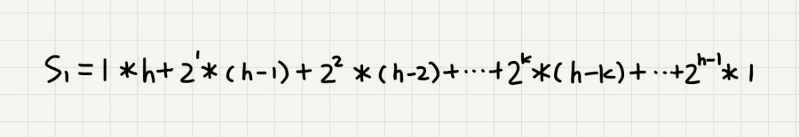
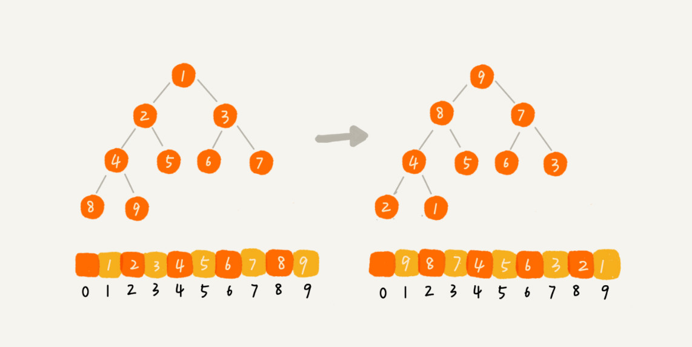

## 1、什么是堆？
&#8195;&#8195;堆是一种特殊的树，树只要满足了以下两点，就是一个堆。
+ 堆是一个完全二叉树。
+ 堆中每一个节点的值都必须大于等于(或小于等于)其左右节点的值。

&#8195;&#8195;完全二叉树就是除了最后一层，其他层的节点个数都是满的，最后一层的节点都靠左排列。
&#8195;&#8195;完全二叉树比较适合用数组来存储。因为我们不需要存储左右子节点的指针，单纯的通过数组的下标，就可以找到一个节点的左右子节点和父节点。(图片来源于网络)


&#8195;&#8195;从图中我们可以看出数组中下标为 `i` 的左子节点，就是下标为 `i*2` 的节点，右子节点就是下标为 `i*2+1`的节点，父节点就是`Math.floor(i/2)`的节点。z
&#8195;&#8195;堆化实际上有两种，从下往上和从上往下。这里我先讲从下往上的堆化方法。
## 2、往堆中插入一个元素（从下往上的堆化方法）
&#8195;&#8195;往堆中插入一个元素时，我们需要不断的调整，让其重新满足堆的特性。堆化操作就是顺着节点所在的路径，向上或者向下，对比，然后交换。 堆化有两种，从下往上和从上往下。


```js
//大顶堆
function insert(arr,data) { 
    arr.push(data);
    let i = arr.length-1,tempIndex; //最后一个非叶子结点的索引值
    // 自下往上堆化 比较父子节点的大小关系 
    while ((tempIndex=Math.floor(i / 2)-1) >= 0 && arr[i] > arr[tempIndex]) { 
     // swap()函数作用：交换下标为i和i/2的两个元素 
        [arr[i],arr[tempIndex]]=[arr[tempIndex],arr[i]];
        i = tempIndex; 
    } 
    console.log(arr);//[8, 6, 7, 3, 2, 1, 5]
} 

insert([7,6,5,3,2,1],8);
```

## 3、删除堆顶元素(从上往下的堆化方法)
&#8195;&#8195;将最后一个结点放到堆顶然后利用同样的父子节点对比方法。对于不满足父子节点大小关系的，互换两个节点，并且重复这个过程，直到父子节点满足大小关系为止。这就是从上往下的堆化方法。因为我们移除的是数组中的最后一个元素，而在堆化的过程中，都是交换操作，不会出现数组中的“空洞”，这种方法堆化之后的结果，满足完全二叉树的特性。


```js
function removeMax(arr) { 
    arr[0]=arr.splice(arr.length-1,1)[0];
    let i=0,n=arr.length;
    // 自上往下堆化  
    while (true) {    
        let maxPos = i;    
        if (i*2+1 <= n && arr[i] < arr[i*2+1]) maxPos = i*2+1;    
        if (i*2+2 <= n && arr[maxPos] < arr[i*2+2]) maxPos = i*2+2;    
        if (maxPos == i) break;   
         [arr[i],arr[maxPos]]=[arr[maxPos],arr[i]]
         i = maxPos;  
    }
    console.log(arr);//[6, 3, 5, 1, 2]
}
removeMax([7,6,5,3,2,1])
```

## 4、堆排序
&#8195;&#8195;借助于堆这种数据结构实现的排序算法，就叫做堆排序。这种排序方法的时间复杂度非常稳定，是 O(nlogn)，并且它还是原地排序算法。
把堆排序的过程大致分解成两个大的步骤，**建堆**和**排序**。
#### 1、建堆
建堆的过程，有两种思路。
+ 第一种，就是前面说过的，在堆中插入一个元素的思路。**从前往后插入数据**，并且每个数据插入堆中时，都是**从下往上堆化**。起初堆中只包含一个数据，调用前面的插入操作，将数组后面的数据依次插入到堆中，这样就完成的**数组的堆化**。
+ 第二种，从**后往前处理数组数据**，并且每个数据插入堆中时，都是**从上往下堆化**。因为叶子结点往下堆化只能自己跟自己比较，所以**从最后一个非叶子结点开始，依次堆化就行了**。如下图所示(图片来源于网络)


代码实现如下
```js
function buildHeap (arr) {
    const len = arr.length;
    //最后一个非叶子节点的索引
    let i = Math.floor(len / 2)-1;
    for (; i >= 0; i--) {
        heapify(arr, len-1, i)
    }
}
function heapify (arr, n, i) {
    while (true) {
        let maxPos = i;
        if (i * 2 + 1 <= n && arr[i] < arr[i * 2 + 1]) maxPos = i * 2 + 1;
        if (i * 2 + 2 <= n && arr[maxPos] < arr[i * 2 + 2]) maxPos = i * 2 + 2;
        if (maxPos == i) break;
        //交换位置
        [arr[i], arr[maxPos]] = [arr[maxPos], arr[i]]
        i = maxPos;
    }
}
```
**建堆的时间复杂度分析。** 因为叶子节点不需要堆化，所以需要堆化的节点从倒数第二层开始，每个节点堆化的过程中，需要比较和交换的节点个数，跟这个节点的高度 `k` 成正比。将每个节点的高度求和，得到的就是建堆的时间复杂度。


将每个非叶子节点的高度求和，得到公式：

根据错位相减法，可以得到下面的公式：


根据等比数列求和的公司来计算，可以得到最终的结果：


因为`h=Math.log2(n)`，代入公式`S`,可以得到`S=O(n)`,所以建堆的时间复杂度就是`O(n)`。

#### 2、排序
&#8195;&#8195;建堆结束后，数组中的数据是按照大顶堆的特性来组织的。数组中的第一个元素就是堆顶，也就是最大的元素。我们将它跟最后一个元素交换，那最大元素就放到了下标为`n`的位置。(数组的长度为`n`)。这个过程就是不断**删除堆顶元素** 的操作，直到队中只剩下最后一个元素，那么就对数组元素排好了序。


```js
function heapSort(arr){
    buildHeap(arr);
    let len=arr.length-1;
    while(len>0){
        //将堆顶元素放到最后排好序的数组的首位
        [arr[0],arr[len]]=[arr[len],arr[0]];
        len--;
        //将最大元素调整到堆顶
        heapify(arr,len,0)
    }
    console.log("排好序的数据",arr);
}
```
分析：整个堆排序的过程，都只需要个别临时存储空间，所以对排序是原地排序算法。堆排序包括建堆和排序两个操作，建堆的时间复杂度是`O(n)`,排序的过程的时间复杂度是`O(nlog(n))`,所以对排序整体的时间复杂度是`O(nlog(n))`。堆排序不是稳定的排序算法，在排序的过程中，存在将堆的最后一个节点跟堆顶节点互换的操作，所以就有可能改变数值相同数据的原始相对排序。

## 5、快速排序的性能比堆排序好的原因所在？
+ **堆排序数据访问的方式没有快速排序友好。** 快速排序数据是顺序访问的，可以做缓存处理; 堆排序数据是跳着访问的，对`CPU`缓存不友好。
+ **对于相同的数据，在排序过程中，堆排序算法的数据交换次数要多余快速排序**。堆排序的第一步是建堆，建堆的过程会打乱数据原有的相对先后顺序，导致源数据的有序度降低。对于一组已经有序的数据来说，经过建堆之后，数据反而变得更加无序了。


## 6、堆的应用
### 1、优先级队列
&#8195;&#8195;优先级队列中，数据的出队顺序不是先进先出，而是按照优先级来，优先级最高的，最先出队。
&#8195;&#8195;堆和优先级队列非常相似。一个堆就可以看成是一个优先级队列。很多时候，它们只是概念上的区分而已。往优先级队列中插入一个元素，就相当于往堆中插入一个元素；从优先级队列中取出优先级最高的元素，就相当于取出堆顶元素。

#### 1、合并有序小文件
&#8195;&#8195;我们将从小文件中取出来的字符串放入到小顶堆中，那堆顶的元素，也就是优先级队列队首的元素，就是最小的字符串。我们将这个字符串放入到大文件中，并将其从堆中删除。然后再从小文件中取出下一个字符串，放入到堆中。循环这个过程，就可以将 100 个小文件中的数据依次放入到大文件中。
#### 2、高性能定时器
&#8195;&#8195;假设我们有一个定时器，定时器中维护了很多定时任务，每个任务都设定了一个要触发执行的时间点。定时器每过一个很小的单位时间（比如 1 秒），就扫描一遍任务，看是否有任务到达设定的执行时间。如果到达了，就拿出来执行。

&#8195;&#8195;但是，这样每过 1 秒就扫描一遍任务列表的做法比较低效，主要原因有两点：
+ 第一，任务的约定执行时间离当前时间可能还有很久，这样前面很多次扫描其实都是徒劳的；
+ 第二，每次都要扫描整个任务列表，如果任务列表很大的话，势必会比较耗时。

&#8195;&#8195;我们按照任务设定的执行时间，将这些任务存储在优先级队列中，队列首部（也就是小顶堆的堆顶）存储的是最先执行的任务。它拿队首任务的执行时间点，与当前时间点相减，得到一个时间间隔 `T`。

&#8195;&#8195;这个时间间隔 `T` 就是，从当前时间开始，需要等待多久，才会有第一个任务需要被执行。这样，定时器就可以设定在 `T` 秒之后，再来执行任务。从当前时间点到（`T-1`）秒这段时间里，定时器都不需要做任何事情。当 `T` 秒时间过去之后，定时器取优先级队列中队首的任务执行。然后再计算新的队首任务的执行时间点与当前时间点的差值，把这个值作为定时器执行下一个任务需要等待的时间。这样，定时器既不用间隔 1 秒就轮询一次，也不用遍历整个任务列表，性能也就提高了。

### 2、利用堆求`Top K`
```js
var findKthLargest = function(arr, k) {
    //   return nums.sort((a,b)=>b-a)[k-1];
    buildHeap(arr);
    let len=arr.length-1;
    while(k>1){
        //将堆顶元素放到最后排好序的数组的首位
        [arr[0],arr[len]]=[arr[len],arr[0]];
        len--;
        k--;
        //将最大元素调整到堆顶
        heapify(arr,len,0)
    }
    return arr[0]
};
function buildHeap (arr) {
    const len = arr.length;
    //最后一个非叶子节点的索引
    let i = Math.floor(len / 2)-1;
    for (; i >= 0; i--) {
        heapify(arr, len-1, i)
    }
}
function heapify (arr, n, i) {
    while (true) {
        let maxPos = i;
        if (i * 2 + 1 <= n && arr[i] < arr[i * 2 + 1]) maxPos = i * 2 + 1;
        if (i * 2 + 2 <= n && arr[maxPos] < arr[i * 2 + 2]) maxPos = i * 2 + 2;
        if (maxPos == i) break;
        //交换位置
        [arr[i], arr[maxPos]] = [arr[maxPos], arr[i]]
        i = maxPos;
    }
}
```

### 3、利用堆求中位数
```js

```