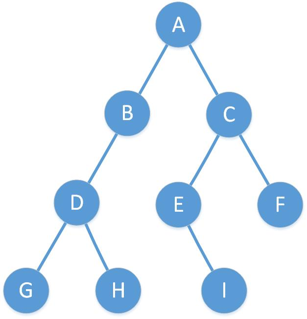

## 1、树的定义
&#8195;&#8195;结点拥有的子树称为结点的度，度为 `0` 的结点称为叶结点，度不为 `0`的称为分支节点。树的度是树内各节点的度的最大值。树中结点的最大层次称为树的深度或高度。

**1.1、二叉树**
+ 每个结点最多有两棵子树。
+ 左子树和右子树是有顺序的。
+ 即使树中某节点只有一颗子树，也要区分是左子树还是右子树。


**1.2、特殊二叉树**
+ 斜树

&#8195;&#8195;所有的结点都只有左子树的二叉树叫左斜树，所有的结点都只有右子树的二叉树叫右斜树。
+ 满二叉树

&#8195;&#8195;所有分支结点都存在左子树和右子树，并且所有叶子都在同一层上，这样的二叉树称为满二叉树。

&#8195;&#8195;**特点：1、叶子只能出现在最下一层；2、非叶子结点的度一定是2；3、在同样深度的二叉树中，满二叉树的结点个数最多，叶子数最多。**

+ 完全二叉树

&#8195;&#8195;对一棵具有n个结点的二叉树按层序编号，如果编号为`i(i≤i≤n)`的结点与同样深度的满二叉树中编号为`i`的结点在二叉树中位置完全相同。判断是否是完全二叉树的最简单方法就是按满二叉树的结构给结点编号，看是否连续，连续则是完全二叉树，否则不是。

&#8195;&#8195;**特点： 1、叶子结点只能出现在最下两层；2、最下层的叶子一定集中在左部连续位置；3、如果结点度为1，则该结点只有左孩子，即不存在只有右子树的情况。4、同样结点的二叉树，完全二叉树的深度最小。5、给定的某个节点下标`i`,可以很容易的计算出此结点的父结点和孩子结点的下标。**
```js
Parent(i)=Math.floor(i/2);//父结点的下标
Left(i)=2i;//左子结点的下标
Right(i)=2i+1;//右子结点的下标
```

**1.3、二叉树的性质**
+ 在二叉树的第i层上至多有`2^i-1`个结点。
+ 深度为k的二叉树至多有 `2^k-1` 个结点（`k≥1`）。
+ 对任何一棵二叉树，如果其终端节点树为 `n0`,度为2的结点数为 `n2`，则 `n0=n2+1`。
```js
//数的结点总数 n0为终端节点个数，n1位度为1的结点个数，n2位度为2额结点个数，
n=n0+n1+n2
n-1=n1+2n2
n0=n2+1
```
+ 具有n个结点的完全二叉树的深度为`|log2n|+1`。
+ 如果对一棵有n个结点的完全二叉树的结点按层序编号对任一节点i有：
    + 如果`i=1`，则结点是二叉树的根，无双亲；如果`i>1`,则其双亲是节点`|i/2|`。  
    + 如果 `2i>n` ,则结点 i 无左孩子（结点i是叶子结点）；否则其左孩子是叶子结点。
    + 如果 `2i+1>n`,则结点i无右孩子；否则其右孩子是结点 `2i+1`。

**1.4、遍历二叉树**



> 1、前序遍历

&#8195;&#8195;先访问根节点，然后前序遍历左子树，再前序遍历右子树。简称为**根左右**。 遍历顺序为`ABDGHCEIF`。


> 2、中序遍历

&#8195;&#8195;中序遍历根节点的左子树，然后访问根节点，最后中序遍历右子树。简称**左内右**。遍历顺序为`GDHBAEICF`

> 3、后序遍历

&#8195;&#8195;从左到右先叶子后节点的方式遍历访问左右子树，**最后是根节点**。简称**左右内**。遍历顺序为`GHDBIEFCA`

> 4、层序遍历
&#8195;&#8195;从树的第一层，从根节点开始访问，从上而下逐层遍历，在同一层中，按从左到右的顺序对结点逐个访问。遍历顺序为`ABCDEFGHI`。

**1.5 树、森林、和二叉树的转换**

> 1、树转换为二叉树
+ 加线。在**所有兄弟结点之间加一条连线**。
+ 去线。对树中每个结点，只保留它与第一个孩子结点的连线，删除它与其他孩子结点之间的连线。
+ 层次调整。以树的根节点为轴心，将整棵树顺时针旋转一定的角度，使之结构层次分明。第一个孩子是二叉树结点的左孩子，兄弟转换过来的孩子是结点的右孩子。

> 2、森林转换为二叉树

&#8195;&#8195;森林是由若干棵树组成。
+ 把每个树转换为二叉树。
+ 第一棵树不动，从第二棵树开始，依次把后一棵二叉树的根结点作为前一棵二叉树的根结点的右孩子，用线连起来。当所有的二叉树连接起来后就得到了由森林转换而来的二叉树。

> 3、二叉树转换为树
+ 加线。若某节点的左孩子结点存在，**则将这个孩子的右孩子结点、右孩子的右孩子结点，反正就是左孩子的n个右孩子都作为此结点的孩子。。将该结点与这些右孩子用线连接起来。**
+ 去线。删除原二叉树中所有结点与其右孩子结点的连线。
+ 层次调整。
> 4、二叉树转换为森林
+ 从根节点开始，若右孩子存在，则把右孩子结点的连线删除，再查看分离后的二叉树，若右孩子存在，则连线删除。。。，直到所有右孩子都删除为止，得到分离的二叉树。
+ 再将每棵分离后的二叉树转换为树即可。

**1.7、赫夫曼树及其应用**

&#8195;&#8195;从树中一个结点到另一个结点之间的分支构成两个结点之间的路径，路径上的分支数目称作**路径长度**。**树的路径长度**就是从根结点到每一结点的路径长度总和。树的带权路径长度为树中所有子结点的带权路径长度之和。**带权路径长度WPL最小的二叉树称作赫夫曼树。**

规定赫夫曼树的左分支代表`0`，右分支代表`1`，则从根结点到叶子结点所经过的路径分支组成的`0`和`1`的序列便为该结点对应字符的编码，这就是**赫夫曼编码**。

**下面是javascript创建树的方法**
```js
//树构造函数
function TreeNode (val) {
    this.val = val;
    this.left = this.right = null;
}
//构造树的函数
function createTree (arr) {
    let level = 0;
    const root = new TreeNode(arr.shift());
    let tempNode = root;
    let res = [];
    while (arr.length) {
        if (tempNode.val) {
            tempNode.left = new TreeNode(arr.shift());
            res.push(tempNode.left);
            tempNode.right = new TreeNode(arr.shift());
            res.push(tempNode.right);
        }
        tempNode = res.shift();

    }
    return root;
}
//[5, 4, 8, 11, null, 13, 4, 7, 2, null, null, null, 1]是层序遍历的结果
createTree([5, 4, 8, 11, null, 13, 4, 7, 2, null, null, null, 1])
```